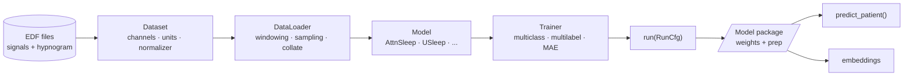

<p align="center">
  
</p>

<div align="center">

[](https://sleepwalker-team.github.io/sleepwalker/)
[](https://www.python.org/)
[](https://github.com/sleepwalker-team/sleepwalker)
[](https://opensource.org/licenses/MIT)

**[Documentation](https://sleepwalker-team.github.io/sleepwalker/)** |
**[Getting Started](https://sleepwalker-team.github.io/sleepwalker/getting-started/)** |
**[How-to Guides](https://sleepwalker-team.github.io/sleepwalker/how-to/)** |
**[Reference](https://sleepwalker-team.github.io/sleepwalker/reference/api/)** |
**[Contributing](https://sleepwalker-team.github.io/sleepwalker/about/contributing/)**

</div>

**Sleepwalker** is a scientific library for training, packaging, and running machine-learning models on polysomnography (PSG) sleep recordings stored in **EDF** files. It covers the full path from raw signals and hypnograms to trained models and reproducible inference: channel mapping, physical-unit conversion, resampling, filtering, windowing, and label alignment are built into the dataset layer, so a model sees a clean, consistent tensor and a trained package repeats the exact preparation that produced it.

It is built for sleep-staging and sleep-event models, from a single recording to **terabyte-scale cohorts on commodity hardware**, and is designed to be driven directly from Python — the CLI and YAML are a thin, repeatable wrapper over the same objects, never a more powerful path.

______________________________________________________________________

## Highlights

Whether you are scoring recordings with a pretrained model or training your own, here is what Sleepwalker gives you:

- **EDF-native data pipeline.** Read PSG EDF files directly. Logical-to-physical channel mapping, unit conversion, band-pass/notch normalization, and windowing are handled by the dataset layer, so models never touch raw file quirks.
- **API first, tooling second.** Datasets, models, trainers, and deployment functions are usable directly from Python. Everything the CLI can do, you can do by constructing the same objects yourself.
- **Reproducible model packages.** A package freezes the trained weights together with the exact EDF preparation used in training, so `predict_patient()` on a new recording repeats the pipeline that produced the result.
- **Built for scale.** Lazy, window-at-a-time loading with worker processes and patient-balanced sampling keeps terabytes of recordings streaming to the GPU without holding them in memory.
- **Ready-made models and trainers.** A growing set of published sleep-staging architectures and task trainers (multiclass, multi-label, self-supervised) that can be applied, combined, or extended.

## Quick Tour

In this quick tour we score a recording and train a model with only a few lines of code.

### Score a recording

Load a trusted model package and call `predict_patient()`:

```python
from sleepwalker.deployment import load_packaged_model

package = load_packaged_model("artifacts/sleep-staging", map_location="cpu")
predictions = package.predict_patient("recordings/night.edf", device="cpu")

print(predictions[["time", "prediction"]].head())
```

`predictions` is a pandas `DataFrame` with one row per output time step: the timestamp, the predicted label, and one probability column per class (`prob__wake`, `prob__rem`, ...). The package supplies the channel selection, units, resampling, normalization, window settings, and class order.

### Train a model in Python

Assemble a dataset, a model, and a trainer, wrap them in a `RunCfg`, and call `run()`:

```python
import torch
from sleepwalker.datasets.Basedataset import ChannelConfig, batch_collate
from sleepwalker.datasets.SleepEDFx import SleepEDFx
from sleepwalker.datasets.normalizer.EEGFilterNormalizer import EEGFilterNormalizer
from sleepwalker.models.AttnSleep import AttnSleep
from sleepwalker.trainer.MulticlassTrainer import MulticlassTrainer
from sleepwalker.trainer.Run import RunCfg, run

classes = ["wake", "n1", "n2", "n3", "rem"]

dataset = SleepEDFx(
    channels=[ChannelConfig("eeg", ["EEG Fpz-Cz"], unit="uV",
                           preprocessors=[EEGFilterNormalizer(fs=100)])],
    sample_frequency=100,
    event_mapping={"sleep stage w": "wake", "sleep stage 1": "n1",
                   "sleep stage 2": "n2", "sleep stage 3": "n3",
                   "sleep stage 4": "n3", "sleep stage r": "rem"},
    total_input="30s",
    stride="30s",
)
dataset.initialize(["data/sleep-edfx/SC/sc4001e-PSG.edf"], num_workers=2)

model = AttnSleep(n_channels=1, ts_len=3000, classes=classes)
trainer = MulticlassTrainer(
    epochs=5,
    classes=classes,
    target_resolution="30s",
    optimizer=lambda m: torch.optim.Adam(m.parameters(), lr=1e-3),
    loss_function=torch.nn.functional.cross_entropy,
)

result = run(RunCfg(
    experiment_name="sleep-edfx-attnsleep",
    model_name="attnsleep",
    model=model,
    trainer=trainer,
    train_datasets=[dataset],
    val_datasets=[],
    test_datasets=[],
    batch_size=32,
    n_samples=4096,
    collate_fn=batch_collate,
    package_path="artifacts/sleep-staging",
))
```

`run()` trains the model, evaluates it, writes a resumable checkpoint, and exports the inference package. The full walkthrough is in the [sleep-staging tutorial](https://sleepwalker-team.github.io/sleepwalker/how-to/train-sleep-staging/).

### Or run the same experiment from the CLI

The identical run, expressed as a YAML config:

```bash
sleepwalker dry   configs/examples/sleep_edfx_tutorial.yml   # smoke test: one epoch, capped data
sleepwalker train configs/examples/sleep_edfx_tutorial.yml   # the real run
```

See [Train from the CLI](https://sleepwalker-team.github.io/sleepwalker/how-to/train-from-cli/) for how the Python objects map to YAML.

## Architecture Overview

Sleepwalker is a layered pipeline. Each layer is a plain Python object you can use on its own:



- **Core / Datasets** read EDF signals and metadata and turn a patient path plus a window index into tensors, applying channel mapping, unit conversion, and normalization.
- **Training** provides loaders, patient-balanced samplers, callbacks, and task trainers that optimize models and describe classification outputs.
- **`RunCfg` / `run()`** is the boundary between assembling an experiment and executing it: it holds already-built objects and knows nothing about losses or optimizers (those live in the trainer).
- **Deployment** saves a model together with a dataset clone so inference repeats the exact EDF preparation used for training.

## What's Included

**Models** — sequence-capable sleep-staging and self-supervised architectures:
`AttnSleep`, `TinySleepNet`, `SeqSleepNet`, `USleep`, `MRASleepNet`, `SleepTransformer`, `UTime`, `MaskedAutoencoder`, and packaged backbone wrappers. → [Model reference](https://sleepwalker-team.github.io/sleepwalker/reference/models/)

**Datasets** — EDF-backed adapters for common sleep corpora:
`SleepEDFx` (Sleep-EDFx), `SHHS`, `ISRUC`, `CAP`, `MNC`, `HSP`, `Ruhrlandklinik`, and more. → [Dataset reference](https://sleepwalker-team.github.io/sleepwalker/reference/datasets/)

**Trainers** — task-specific optimization and evaluation:
`MulticlassTrainer`, `MultiLabelTrainer`, `MaskedAutoencoderTrainer`. → [Trainer reference](https://sleepwalker-team.github.io/sleepwalker/reference/trainers/)

**Pipeline components** — normalizers, augmentation, samplers, callbacks, file selection, and metrics. → [Data pipeline reference](https://sleepwalker-team.github.io/sleepwalker/reference/pipeline/)

## Installation

Sleepwalker requires Python 3.10 or newer. Clone the repository, create a virtual environment, and install the package:

```bash
git clone https://github.com/sleepwalker-team/sleepwalker.git
cd sleepwalker
python -m venv .venv
source .venv/bin/activate
python -m pip install -e .
```

Verify the installation:

```bash
python -c "import sleepwalker; print(sleepwalker.__file__)"
sleepwalker --help
```

Optional extras are grouped by purpose:

```bash
python -m pip install -e ".[datasets]"     # spreadsheet and archive-backed datasets
python -m pip install -e ".[tracking]"     # MLflow and Weights & Biases
python -m pip install -e ".[foundation]"   # foundation-model conversion tools
python -m pip install -e ".[dev,docs]"     # tests and documentation
```

On Windows, activate the environment with `.venv\Scripts\activate` instead of `source .venv/bin/activate`.

## Documentation

Full documentation lives at **[sleepwalker-team.github.io/sleepwalker](https://sleepwalker-team.github.io/sleepwalker/)**. To preview it locally:

```bash
python -m pip install -e ".[docs]"
zensical serve
```

## Citing Sleepwalker

A formal publication is in preparation. Until then, please cite the software by its repository and version, and cite the underlying datasets and original model papers where relevant:

```bibtex
@software{sleepwalker2026,
  title  = {Sleepwalker: Train, package, and run sleep models on EDF recordings},
  author = {{Sleepwalker Contributors}},
  year   = {2026},
  url    = {https://github.com/sleepwalker-team/sleepwalker},
}
```

## Contributing

Contributions are welcome — including changes drafted with LLM-based coding agents. Every pull request is held to the same bar regardless of who or what wrote it: correct, tested, minimal, and consistent with the surrounding code. See the [contributing guide](https://sleepwalker-team.github.io/sleepwalker/about/contributing/) for the design principles, code architecture, and documentation rules.

## Development Status

Sleepwalker is research software and its APIs may change. Serialized model packages use Python/PyTorch serialization: load them only from a trusted source and use a compatible Sleepwalker version.
