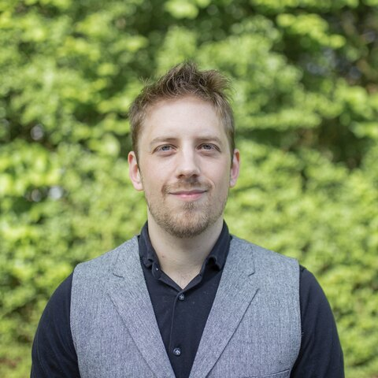
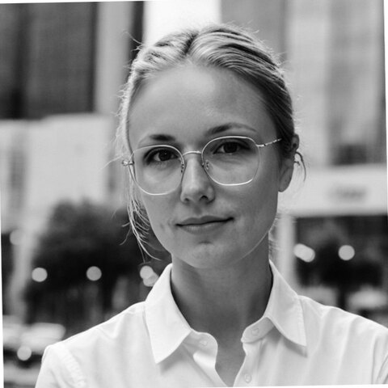
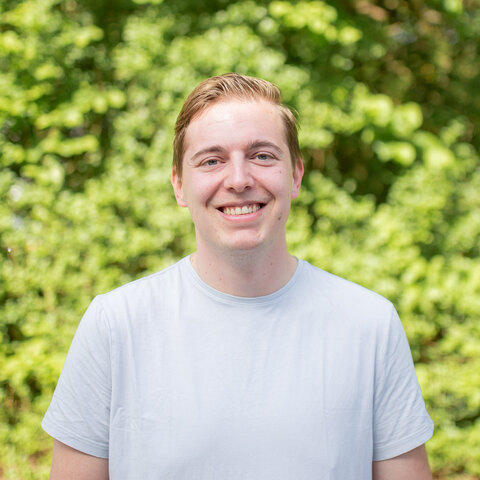
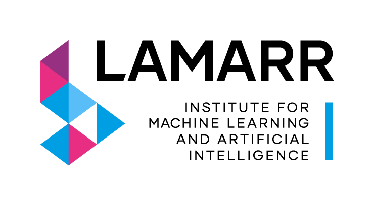

# People

Sleepwalker is developed by researchers in computer science, artificial intelligence, biology, and medical physics. The project brings sleep-analysis models and the data preparation required to use them into one open-source Python package.

Questions about the project and access to research models can be sent to [sleepwalker.lamarr.cs@tu-dortmund.de](mailto:sleepwalker.lamarr.cs@tu-dortmund.de).

  <a class="person-card" href="https://www.linkedin.com/in/sebastian-buschjaeger/" target="_blank" rel="noopener">
    
    <strong>Dr. rer. nat. Sebastian Buschjäger</strong>
    Computer scientist and AI expert
  </a>
  <a class="person-card" href="https://www.linkedin.com/in/dr-rer-medic-sarah-dietz-terjung-a45976209/" target="_blank" rel="noopener">
    
    <strong>Dr. rer. medic. Sarah Dietz-Terjung</strong>
    Biologist and medical physicist
  </a>
  <a class="person-card" href="https://www.linkedin.com/in/matthias-jakobs-319115223/" target="_blank" rel="noopener">
    
    <strong>MSc. Matthias Jakobs</strong>
    Computer scientist and AI expert
  </a>

## Funding and collaboration

  
  

