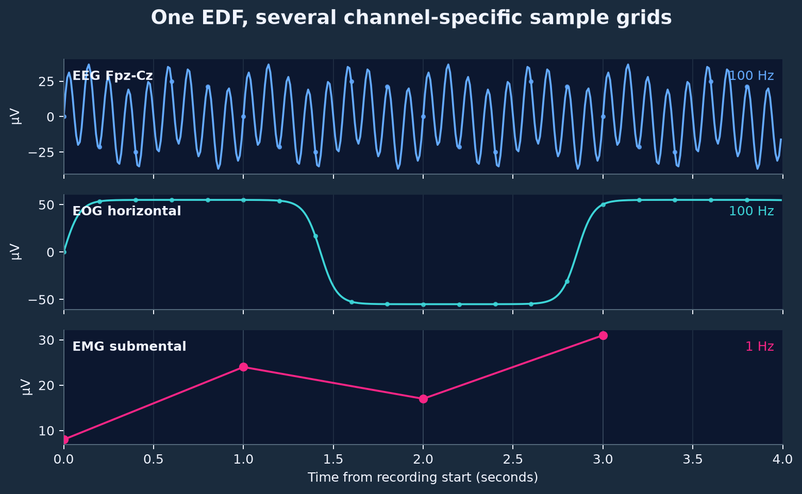
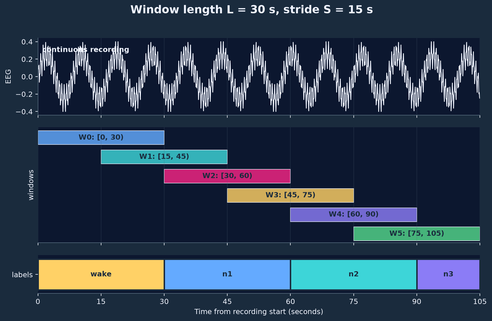
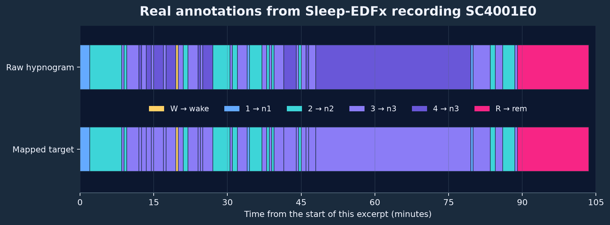
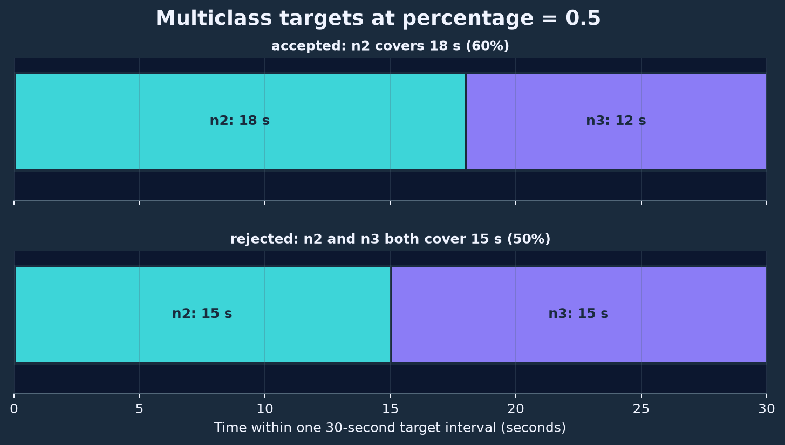

# Loading data

A sleep recording is not a table with one row per training example. It is a collection of signals measured continuously over several hours, plus annotations that describe intervals on the same timeline. Before a model can use the recording, the requested signals must be loaded, their samples aligned, the annotations mapped, and the timeline cut into finite windows. This page explains how Sleepwalker turns the raw files into dataset tensors. We use [Sleep-EDFx](../how-to/sleep-edfx.md) for concrete examples.


## One recording contains several time series

Polysomnography records several physiological quantities at once. Electroencephalography (EEG) measures electrical activity at the scalp, electrooculography (EOG) captures eye movements, and electromyography (EMG) measures muscle activity. Respiratory and cardiac signals are common in clinical recordings as well. These measurements are commonly stored in [EDF](https://www.edfplus.info/) files. EDF stores every recorded signal as a channel with its own name, physical unit, sampling frequency, and numeric range.

Let \(s_c(t)\) denote the continuously varying physical signal measured by channel \(c\), such as the voltage at an EEG derivation. The recorder does not store \(s_c(t)\) at every possible time. It samples the signal \(f_c\) times per second and stores the resulting sequence \(x_c[0],x_c[1],\ldots\):

$$
x_c[n] = s_c\!\left(t_0 + \frac{n}{f_c}\right), \qquad n=0,\ldots,N_c-1.
$$

Here, \(t_0\) is the start time of the recording, \(n\) is the sample number, and \(N_c\) is the number of stored samples. A recording of duration \(T\) seconds contains approximately \(N_c=T f_c\) samples in channel \(c\). If a patient is recorded for eight hours, an EEG channel sampled at 100 Hz contains approximately

$$
8 \cdot 60 \cdot 60 \cdot 100 = 2{,}880{,}000
$$

values. A 1 Hz channel from the same patient contains only \(28{,}800\) values.



## Channel configuration

EDF headers contain the names chosen by the recording system or dataset producer. These are not standardized across datasets, vendors and sensors and thus often vary between datasets. For example, [Sleep-EDFx](../how-to/sleep-edfx.md) contains two EEG derivations named `EEG Fpz-Cz` and `EEG Pz-Oz`, whereas [SHHS](https://sleepdata.org/datasets/shhs/pages) only contains one `EEG` channel. Moreover, multiple channel can form one physiological signal group. The two EEG channels `EEG Fpz-Cz` and `EEG Pz-Oz` in [Sleep-EDFx](../how-to/sleep-edfx.md) both measure EEG, but from different electrode pairs. Sleepwalker refers to these channels as **physical channels**. They identify actual sensor recordings in an EDF and are mapped to **logical channels** which are required by the ML models. For example, a model may require one channel called `eeg` without specifying one particular electrode derivation. The [`ChannelConfig`](../reference/api.md#channel-config) maps the logical input to the physical EDF channels that may supply it. `ChannelConfig` also selects physical or digital decoding and an ordered list of processors. Conversion is an explicit step: `ConvertUnit("uV")` converts volts to microvolts by multiplying values by a million. Voltage, pressure and flow conversions stay within their respective measurement families.

`read_mode="physical"`, the default, applies the EDF header's gain and offset. `read_mode="digital"` returns floating-point EDF codes. It bypasses gain magnitude and offset while retaining the sign of a valid gain. Codes do not establish the sensor's original ADC range or a shared bit depth across recording systems. Signal decoding uses pyEDFlib; it does not silently switch to a backend that returns different units.

Each processor receives an array of shape `(N, 1)`, its current `unit`, and `is_recording`. It returns `(values, unit)` or `None` to exclude that input. Conversion updates the unit, filtering preserves it, and normalization returns `"dimensionless"`. Digital input starts with `"counts"`; unknown physical units use `None`. Documented unknown waveform scales can use `"relative"`.

```python
from sleepwalker.datasets.Basedataset import ChannelConfig
from sleepwalker.datasets.normalizer import ConvertUnit, EEGFilterNormalizer, RecordingZScore

eeg = ChannelConfig(
    logical_name="eeg",
    physical_names=["EEG Fpz-Cz", "EEG Pz-Oz"],
    preprocessors=[
        ConvertUnit("uV"),
        EEGFilterNormalizer(fs=100, normalize=False),
        RecordingZScore(),
    ],
)
```

`ConvertUnit` rejects unknown or incompatible source units. Put a documented source-label correction before `ConvertUnit` in the processor list. A label correction does not recover an unknown gain. There is no automatic calibration inference or generic physiological range check.

`EEGFilterNormalizer(normalize=False)` filters without amplitude scaling. With `normalize=True`, it also applies its configured mean and standard deviation. `FixedScale` expresses fixed scaling separately. These values are configured, not fitted. Filter `fs` must equal the dataset's `sample_frequency`. See the [normalizer reference](../reference/pipeline.md#normalizers).

## Recording and window normalization

The same processor list serves recording preparation and window access:

| Stage | Calls |
| --- | --- |
| Recording preparation | Read the interval between `EDFFile.start_date` and `end_date` when a step has `fit`. Do not mask samples by annotation or window coverage. Fit optional steps in order, applying predecessors to prepare the next fit's input. Pass `is_recording=True` to both fitting and application. Stop after the last fit. |
| Window access | Read and resample the window, then call every step with `is_recording=False`. Never fit. Call `prepare_channels` if configured, then pad or truncate its outputs before sample assembly. |
| Sample assembly | Format processed logical columns and targets. |

A fitted step implements `fit(values, *, unit, is_recording)`. It updates itself in place and returns `self` on success or `None` to exclude the recording alias. Application uses `__call__(values, *, unit, is_recording)`; functions and lambdas use the same arguments without `self`.

**Recording normalization is independent for every logical channel and physical alias.** `RecordingZScore` learns the mean and population standard deviation; `RecordingRobustScale` learns the median and quantile span. Preparation copies the configured processors for each recording and alias. Sparse annotations and annotation callbacks do not create a signal coverage mask. Window access reuses these fitted parameters.

Window normalization computes statistics during application. The explicit argument lets a window-only step preserve input during recording preparation:

```python
import numpy as np


def window_zscore(values, *, unit, is_recording):
    if is_recording:
        return values, unit
    if not np.isfinite(values).all():
        return None
    scale = values.std()
    if scale <= 0:
        return None
    return (values - values.mean()) / scale, "dimensionless"
```

Steps can repair data, convert values using documented rules, or reject input. Recording rules can accept short sensor dropouts while window rules reject affected windows. A `None` result during preparation excludes the physical alias; the recording is excluded only when a required logical channel has no usable alias. During window access, another eligible alias is tried. If all aliases fail, only that window is excluded. Exceptions report processing errors and propagate. With `group_sampling_strategy="none"`, all selected aliases must succeed to preserve the output shape.

`read_mode` and `preprocessors` accept shared settings or complete dictionaries keyed by physical alias. Two aliases can use different conversions, filters, or normalization:

```python
from sleepwalker.datasets.normalizer import RecordingRobustScale

eeg = ChannelConfig(
    "eeg", ["C3-M2", "C4-M1"],
    preprocessors={
        "C3-M2": [ConvertUnit("uV"), EEGFilterNormalizer(fs=100, normalize=False), RecordingZScore()],
        "C4-M1": [ConvertUnit("uV"), EEGFilterNormalizer(fs=100, normalize=False), RecordingRobustScale()],
    },
)
```

## Dataset unit corrections

Dataset modules provide ordinary processor functions. Add them explicitly to a channel's list; adapters do not alter units implicitly. Their docstrings explain the evidence and limits. The functions change unit labels while retaining decoded values and the EDF gain and offset. They need no header dictionary or remote correction file.

```python
from sleepwalker.datasets.Apples import get_preprocessors as apples_preprocessors

apples_eog = ChannelConfig(
    "EOG", ["LOC", "ROC"],
    preprocessors={
        name: [*apples_preprocessors(name), ConvertUnit("uV"), RecordingZScore()]
        for name in ["LOC", "ROC"]
    },
)
```


YAML names an ordinary correction function directly. Filters and fitted normalizers use constructor specifications:

```yaml
logical_name: EOG
physical_names: [LOC, ROC]
preprocessors:
  - sleepwalker.datasets.Apples.correct_apples_eeg
  - name: sleepwalker.datasets.normalizer.ConvertUnit.ConvertUnit
    target: uV
  - name: sleepwalker.datasets.normalizer.EEGFilterNormalizer.EEGFilterNormalizer
    fs: 100
    normalize: false
  - name: sleepwalker.datasets.normalizer.RecordingZScore
```

| Dataset | Explicit physical interpretation |
| --- | --- |
| SHHS | Keep labelled `NEW AIR` microvolt calibration. Declare missing older airflow/belt units as relative. Declare missing saturation units as percent. Division by 125 or 250 does not recover unknown gain. |
| APPLES | Supply NSRR's EEG/EOG microvolt assumption for missing units. Declare other missing waveform units as relative, and saturation as percent. Preserve non-identity EDF mappings. |
| HSP | Correct the known saturation microvolt label to percent through `correct_hsp_saturation`. |
| Ruhrlandklinik | Convert voltage and pressure within their measurement families. `ConvertUnit("%")` rejects saturation labelled as voltage before filtering. No additional header rejection rule is required. |

For SHHS, both airflow variants can use recording normalization without assuming that their amplitudes are microvolts:

```python
from dataclasses import replace
from sleepwalker.datasets.normalizer import RespirationFilterNormalizer, SaturationFilterNormalizer
from sleepwalker.datasets.SHHS import get_preprocessors as shhs_preprocessors

flow = ChannelConfig(
    "Airflow", ["NEW AIR", "AIRFLOW"],
    preprocessors={
        name: [*shhs_preprocessors(name), RespirationFilterNormalizer(fs=100, normalize=False), RecordingZScore()]
        for name in ["NEW AIR", "AIRFLOW"]
    },
)
saturation = ChannelConfig(
    "SpO2", ["SaO2"],
    preprocessors=[*shhs_preprocessors("SaO2"), ConvertUnit("%"), SaturationFilterNormalizer(fs=100, normalize=False)],
)
digital_flow = replace(flow, read_mode="digital")
```

Modes can also differ between aliases: `read_mode={"NEW AIR": "physical", "AIRFLOW": "digital"}`. Keep saturation physical when its absolute percentage matters. Normalization removes constant amplitude and offset differences; it cannot recover missing signals or make different sensors equivalent.


## Derived channels and rereferencing

Use `prepare_channels` when a computation needs several processed source channels. Declare those sources through `ChannelConfig`, including aliases and their processor lists. The callback receives `{logical_name: (values, unit)}` and returns the same dictionary format. Arrays have shape `(N, 1)`. Supply `input_channels` to select and order the returned model inputs. Ten configured sources can therefore produce three model channels.

```python
from sleepwalker.datasets.UnlabelledDataset import UnlabelledDataset
from sleepwalker.models.TinySleepNet import TinySleepNet


def reference(channels):
    c3, unit_c3 = channels["C3"]
    m2, unit_m2 = channels["M2"]
    if unit_c3 != unit_m2:
        return None
    return {"EEG": (c3 - m2, unit_c3)}


dataset = UnlabelledDataset(
    channels=[
        ChannelConfig("C3", ["C3", "EEG C3"], preprocessors=[ConvertUnit("uV"), EEGFilterNormalizer(fs=100, normalize=False)]),
        ChannelConfig("M2", ["M2", "A2"], preprocessors=[ConvertUnit("uV"), EEGFilterNormalizer(fs=100, normalize=False)]),
    ],
    prepare_channels=reference,
    input_channels=["EEG"],
    sample_frequency=100,
    total_input="30s",
)
model = TinySleepNet(
    n_channels=len(dataset.get_input_channels()),  # one EEG output, two sources
    ts_len=dataset.get_timeseries_len(),
    sampling_frequency=dataset.sample_frequency,
    seq_len=1,
)
dataset.initialize(["patient.edf"], num_workers=0, strict=True)
```

The callback runs once per window, after all source processor lists and before final padding or truncation. It can combine physical and digital sources, repair values, or return `None` to reject the window. It does not run during recording fitting: fitted normalizers belong to the declared sources. Units are the units returned by those processors, such as `"counts"`, `"uV"`, or `"dimensionless"`. No implicit conversion occurs when channels are combined.

Accepted windows must return every name in `input_channels`. The list sets tensor column order; extra returned names are ignored. Use separate logical source names when several physical channels must be available at once; aliases within one group select alternative sources. Companion `quality_data` keeps its source logical names for `prepare_sample`; the mapper does not combine quality scores automatically.

Without a callback, configured logical channels remain the model inputs. With a callback, `input_channels` is required. `get_input_channels()` returns these configured names without reading data or calling processors, including before initialization. Inference templates and model packages retain the same list. The CLI derives model channel count from this list, as it does for ordinary channel configurations. In YAML, put the output names on the dataset specification:

```yaml
input_channels: [EEG]
prepare_channels: my_processing.reference
```


## Sampling frequencies

Every channel in an EDF declares its own sampling frequency. Channels in one file need not agree and sample rates can also vary across files for the same channel. In [Sleep-EDFx](../how-to/sleep-edfx.md), for example, the EEG and EOG channels are sampled at 100 Hz, while the filtered EMG envelope is sampled at 1 Hz. A model tensor has one shared time dimension, so Sleepwalker places the selected channels on a common grid. Put differently, physical channels with different sample rates are up- and downsampled to a common `sample_frequency`. For target frequency \(f_s\), the output timestamps are

$$
\tau_i = t_\text{start} + \frac{i}{f_s}, \qquad i=0,\ldots,N-1.
$$

Sleepwalker currently supports four `resample_type` values:

- [`nearest`](https://pandas.pydata.org/docs/reference/api/pandas.api.typing.Resampler.nearest.html) uses the sample nearest to each output timestamp.
- [`mean`](https://pandas.pydata.org/docs/reference/api/pandas.api.typing.Resampler.mean.html) averages the samples in each output-time bin.
- [`max`](https://pandas.pydata.org/docs/reference/api/pandas.api.typing.Resampler.max.html) takes the largest sample in each output-time bin.
- [`polyphase`](https://docs.scipy.org/doc/scipy/reference/generated/scipy.signal.resample_poly.html) uses polyphase filtering. This is the appropriate built-in choice when a continuous waveform must be downsampled with an antialiasing filter.

The choice depends on the signal and experiment. `nearest`, for example, preserves observed values but does not apply an antialiasing filter. It may be suitable for discrete or already low-rate values, but is usually not the right choice for downsampling a raw waveform.

## Windowing of EDF files

A typical night is around six hours of sleep, which easily leads to \(2,160,000\) datapoints if sampled at 100 Hz. Even with large amounts of VRAM and multiple GPUs, this is typically too much data to process a single EDF file in one forward pass. Hence, for training, EDF files are divided into windows. Let a recording cover \([t_0,t_0+T)\), let \(L\) be the input duration, and let \(S\) be the stride between consecutive windows. Window \(k\) is

$$
W_k = \left[t_0+kS,\;t_0+kS+L\right).
$$

In code, \(L\) is `total_input` and \(S\) is `stride`. Both accept strings such as `"30s"` or `"5min"` or a `pd.Timedelta`, and both must be positive. `stride` defaults to `total_input` and may not be larger than `total_input`; Sleepwalker does not currently allow windows that skip signal samples. See [`BaseDataset`](../reference/api.md#base-dataset) for the full parameter list.

For an uninterrupted recording, the number of complete windows is

$$
K = \left\lfloor\frac{T-L}{S}\right\rfloor + 1.
$$

When \(S=L\), adjacent windows do not overlap. When \(S<L\), consecutive windows share signal samples. Overlap increases the number of examples, but neighboring examples are strongly correlated and must not be treated as independent patients.


*Thirty-second windows with a 15-second stride.*

At target sampling frequency \(f_s\), every window contains

$$
N = \operatorname{round}(L f_s)
$$

time points per logical channel. With `total_input="30s"`, `sample_frequency=100`, and one EEG input, Sleepwalker returns `data` with shape `[3000, 1]`. A batch of 16 windows has shape `[16, 3000, 1]`, ordered as batch, time, channel.

Window starts are multiples of `stride` counted from the first usable sample of the recording, so a `stride="15s"` produces windows starting at 0 s, 15 s, 30 s, and so on, and every window is dropped if it does not fit into the usable signal range. Once labels are available, `initialize()` does not keep every window in that grid: it keeps only the windows that overlap at least one retained annotation interval. Windows that fall entirely inside an unlabelled gap between two blocks of annotations are therefore never offered. See [what happens when a dataset is initialized](#what-happens-when-a-dataset-is-initialized).

!!! important
    Filters and window-dependent normalization receive the actual requested window. Filter boundary effects and window statistics can therefore differ between overlapping windows. During recording fitting, preceding filters receive the complete recording. The EDF cache stores native samples before resampling and processing; enabling it does not change this lifecycle.

## What happens when a dataset is initialized

Constructing a [`BaseDataset`](../reference/api.md#base-dataset) stores configuration but does not inspect any recordings. This allows us to handle large datasets and cohorts without copying index data structures and only initialize the dataset right before we use it. The explicit call

```python
dataset.initialize(patient_paths, num_workers=4, strict=True)
```

prepares the `dataset` for iteration on the given list of patients via `patient_paths`. It performs the following indexing:

1. read each EDF header;
2. verify that every logical channel has an available physical channel;
3. validate physical units;
4. locate and map the annotations (see next section); 
5. determine the common usable time range; and
6. calculate valid window start positions; and
7. fit any processors that implement `fit` on the complete recording.

Signal values are normally loaded lazily when `dataset[index]` is requested. The selected window is read, resampled, processed, and passed through the target and sample callbacks. The result normally contains:

```python
{
    "data": ...,     # torch.Tensor [time, channel]
    "target": ...,   # task-dependent tensor, if labels are available
    "patient": ...,  # source EDF path
    "time": ...,     # input-window start
}
```

Adapters that expose a secondary annotation timeline can add `target_extra` (see [loading data with labels](#loading-data-with-labels)). `len(dataset)` counts the prepared windows over all patients, not the patients themselves; use [`get_n_patients()`](../reference/api.md#base-dataset) or [`get_patient_ranges()`](../reference/api.md#base-dataset) for the patient dimension.

`strict=True` makes an invalid patient fail initialization. With `strict=False`, invalid headers, annotations, and explicitly rejected recordings are logged and skipped. Processor errors always propagate. Stateless steps run during window access, so their rejection is handled there.

!!! warning "Data loading pressures I/O bandwidth"
    Data is loaded lazily from disk and is *not* held in memory. Each requested window means we are reading some part of an EDF file into main memory. This allows us to process even terabytes of data on fairly small machines, but also pressures I/O. In many cases, I/O bandwidth will be the limiting factor and not GPU speed. We highly recommend storing data on local SSDs for good performance rather than on a networked file system.

## A complete example

Below is one complete [`BaseDataset`](../reference/api.md#base-dataset) example. It requests one logical `eeg` input, accepts either of the two listed Sleep-EDFx derivations, converts the selected signal to microvolts, resamples it to 100 Hz, applies the EEG normalizer, and exposes non-overlapping 30-second windows. `group_sampling_strategy="first"` makes channel selection deterministic for each window when both derivations are present. It selects the first channel, i.e. "EEG Fpz-Cz", if both are available. Note that dataset construction is lazy.   

```python
from torch.utils.data import DataLoader

from sleepwalker.datasets.Basedataset import ChannelConfig, batch_collate
from sleepwalker.datasets.SleepEDFx import SleepEDFx
from sleepwalker.datasets.UnlabelledDataset import UnlabelledDataset
from sleepwalker.datasets.normalizer import ConvertUnit, EEGFilterNormalizer
from sleepwalker.datasets.utils import get_edf_files_in_repo

data_root = "data/sleep-edfx/SC"
patient_paths = [path for path in get_edf_files_in_repo(data_root) if path.endswith("-PSG.edf")]

eeg_channel_config = ChannelConfig(
    logical_name="eeg",
    physical_names=["EEG Fpz-Cz", "EEG Pz-Oz"],
    preprocessors=[ConvertUnit("uV"), EEGFilterNormalizer(fs=100)],
)

dataset = SleepEDFx(
    channels=[eeg_channel_config],
    sample_frequency=100,
    total_input="30s",
    stride="30s",
    group_sampling_strategy="first",
)
dataset = UnlabelledDataset.from_dataset(dataset)

dataset.initialize(patient_paths, num_workers=0, strict=True)
loader = DataLoader(dataset, batch_size=16, shuffle=False, collate_fn=batch_collate)
for batch in loader:
    print(batch["data"].shape)  # [batch, time, channel]
    print(batch["patient"][0], batch["time"][0])
```

## Loading data with labels

For training a supervised model, labels are also required. Each EDF file typically comes with a number of annotations such as sleep stages, breathing patterns, or arousals. These annotations are usually sparse. Rather than storing a label at every signal sample, a sidecar format such as CSV or XLS records intervals such as

$$
a_j = \left(s_j,e_j,r_j\right),
$$

where \(s_j\) is the start time, \(e_j\) is the end time, and \(r_j\) is the raw label. [Dataset](../reference/api.md#base-dataset) classes convert their source format into a standardized table with `Starttime`, `Endtime`, and `Label` columns. As an example, consider recording `SC4001E0` from the [Sleep-EDFx](../how-to/sleep-edfx.md) dataset. Around the first transition out of the initial wake interval, we have the following DataFrame rows:

| `Starttime` | `Endtime` | `Label` |
| --- | --- | --- |
| `1989-04-25 00:43:30` | `1989-04-25 00:45:30` | `sleep stage 1` |
| `1989-04-25 00:45:30` | `1989-04-25 00:52:00` | `sleep stage 2` |
| `1989-04-25 00:52:00` | `1989-04-25 00:52:30` | `sleep stage 3` |

!!! note
    Consecutive events are already merged inside the Dataset, i.e. epochs with the same label are stored as one longer interval. For example, the second row therefore represents thirteen consecutive 30s epochs of stage 2, not one 390-second scoring epoch.

Similar to channel names, labels and annotations are also **not** standardized and often laboratory dependent. For example, [Sleep-EDFx](../how-to/sleep-edfx.md) stores its hypnogram in a matching `*-Hypnogram.edf` file, where sleep stages were scored using the [Rechtschaffen and Kales system](https://www.ncbi.nlm.nih.gov/nlmcatalog/173471), with the raw labels `Sleep stage W`, `1`, `2`, `3`, `4`, and `R`. Modern scoring uses a smaller taxonomy in which `sleep stage 3` and `sleep stage 4` are merged into `n3`. 

We can supply an `event_mapping` dictionary to the dataset that canonicalizes events. This mapping uses exact string matching and may map several raw labels to one canonical label. As an example, to map the historical stages 3 and 4 into `n3` we can use:

```python
event_mapping = {
    "sleep stage w": "wake",
    "sleep stage 1": "n1",
    "sleep stage 2": "n2",
    "sleep stage 3": "n3",
    "sleep stage 4": "n3",
    "sleep stage r": "rem",
}
```

!!! important "Several datasets use lowercase labels in Sleepwalker"

    The Sleep-EDFx reader converts every annotation label to lowercase. Keys in `event_mapping` must therefore use `sleep stage w`, not `Sleep stage W`. An incorrectly capitalized key does not match the annotation. 
    Several other adapters, including HSP, MNC, Ruhrlandklinik, Stages, SVUH-UCD, and WSC, also lowercase labels while reading them. This is, however, only a convention and not enforced.

!!! note
    A typical dataset adapter loads labels when an `event_mapping` is provided and may perform rejection sampling to reject windows without a clear label or sufficient data quality. Setting `event_mapping=None` disables label extraction. This can become confusing during deployment when no labels are available. To make label-free use explicit, convert a configured dataset with [`UnlabelledDataset.from_dataset(dataset)`](../reference/api.md#unlabelled-dataset), as shown in the first complete example on this page. `BaseDataset` does not currently provide a `to_unlabelled()` method.


A dataset provides data preparation and target mapping, but does not know how to interpret these targets. In its most general form, sleep analysis is a group of multiple tasks, i.e. a multi-task, multi-label machine learning problem. For example, while a patient can only be in one of the five sleep stages ("wake", "n1", "n2", "n3", "rem"), she can also experience a leg movement and snoring in parallel. The label interpretation is up to the model and model [trainer](../reference/api.md#multiclass-trainer).

!!! note "Omit labels that the task should ignore"

    With the default `remove_unmapped_events=True`, an annotation is removed when its raw label is not a key in `event_mapping`. For example, the above mapping therefore excludes sleep stages with unclear mapping (e.g. `sleep stage ?`). Set `remove_unmapped_events=False` when you want to retain all raw labels for which no mapping is found.



*The lower row applies the `event_mapping` above. Raw stages 3 and 4 both become `n3`.*

Sleep staging is regular: a standard epoch is 30 seconds and the label vocabulary is widely understood. Other sleep events may last arbitrary numbers of seconds, overlap one another, or use dataset-specific names. You can supply a Python function `prepare_target` to the dataset to prepare the target for training. `prepare_target` runs once per candidate item *before* the signal window is loaded and can also be used to reject windows, if no label can be computed for a given window. It receives the target interval labels and should either:

- return `None` to reject the item cheaply, or
- return a dictionary with the prepared target payload.

Rejected candidates are handled by the dataset's `rejection_strategy`: `"none"` returns no item for that index, while `"patient"`, `"global"`, and `"patient_then_global"` draw fallback candidates within the same patient or across the cohort.

`target` always covers the complete input window. It is a time-indexed DataFrame with one column per canonical label, i.e. per value of `event_mapping`, and one row per sample of `sample_frequency`. For the 30-second window at 100 Hz used below, `target` therefore has \(30\cdot100=3000\) rows and `target["n2"].mean()` is the fraction of the window that is scored `n2`.

The optional second argument `target_extra` carries a second annotation timeline for the same window in the same format. It is only populated by adapters that declare an additional annotation source through `has_extra_target()` and `get_extra_event_df()`: `ABC` and `MROS` (alternate annotation source), `ISRUC` (second scorer when `merge=False`), `Ruhrlandklinik` with `return_nox=True`, `NumpyDataset` shards written with a `target_extra` array, and `MultiDataset` when every component dataset provides one. For [Sleep-EDFx](../how-to/sleep-edfx.md) it is always `None`. A missing or ambiguous `target_extra` does not reject an otherwise valid primary target.

As an example, consider the following function that returns the fraction of a given timeframe that is scored `n2`. It rejects windows where no "n2" occurs. 

```python
import pandas as pd
import torch


def prepare_n2_coverage(
    target: pd.DataFrame | None,
    target_extra: pd.DataFrame | None = None,
    patient: object | None = None,
    time: pd.Timestamp | None = None,
) -> dict[str, torch.Tensor] | None:
    if target is None or "n2" not in target.columns:
        return None
    n2_coverage = float(target["n2"].mean())
    if n2_coverage == 0:
        return None
    return {"target": torch.tensor([n2_coverage], dtype=torch.float32)}
```

You don't need to write your own callbacks for most tasks. For single multiclass classification problems you can use [prepare_multiclass_target](../reference/api.md#prepare-multiclass-target). For multi-task problems in which labels from different tasks can overlap, use [prepare_multitask_target](../reference/api.md#prepare-multitask-target). The following example adds the stage mapping and converts each 30-second annotation interval into a five-class target. 

```python
prepare_target=partial(
    prepare_multiclass_target,
    target_classes=classes,
    target_resolution="30s",
    percentage=0.5,
)
```

`prepare_multiclass_target` returns a one-hot tensor in the order given by `target_classes` and rejects an interval if it cannot resolve exactly one class which covers more than 50% of the interval. The three arguments in the example define that conversion. `target_classes=classes` fixes both the available classes and their order in the returned tensor. `target_resolution="30s"` selects a 30-second annotation interval from the input window. `percentage=0.5` requires a class to cover at least half of each target interval. More formally, for class \(c\), its coverage in window \(W_k\) is the total duration of mapped annotation intervals that intersect the window:

$$
d_{k,c} = \left|W_k \cap \bigcup_{j:\,m(r_j)=c}[s_j,e_j)\right|.
$$

Here, \(m\) is `event_mapping`. The union collects every annotation interval that maps to class \(c\), the intersection keeps only the portions inside \(W_k\), and the outer bars measure their combined duration. The equation therefore answers a concrete question: *for how many seconds was class \(c\) active inside this target interval?* Taking the union also prevents overlapping annotations of the same class from being counted twice.

`prepare_multiclass_target(..., percentage=0.5)` requires a class to cover at least half of each target interval. In a 30-second interval, the threshold is therefore

$$
30\,\mathrm{s} \cdot 0.5 = 15\,\mathrm{s}.
$$

If `n2` covers 18 seconds and `n3` covers 12 seconds, only `n2` reaches the threshold and the result is the one-hot target for `n2`. Put differently, the **entire** window is assigned `n2`. If both cover 15 seconds, both reach the threshold. That result is not a valid multiclass target, so the callback returns `None` and the window is rejected.



*These two constructed examples show the thresholding rule; they are not excerpts from Sleep-EDFx.*

!!! note
    The annotation timeline that `prepare_target` receives spans the complete input window and `time` is the window start. Which part of that window is actually supervised is decided by the callback: [`prepare_multiclass_target()`](../reference/api.md#prepare-multiclass-target) selects an interval of `target_resolution` and places it with `target_position`, which is `"center"` by default, or `"last"`, or at an explicit `target_offset`. A 30 s target inside a 90 s input therefore starts 30 s after the window start, and a `target_resolution` larger than the input window is rejected. `BaseDataset` itself has no option that changes this placement. <!-- TODO: decide whether the temporal placement of the supervised interval should become part of the dataset or expert contract instead of a callback argument. See the [roadmap](../roadmap.md#document-target-interval-placement). -->

!!! note "Annotations can overlap"

    Annotation data is multi-label by nature: several event intervals can be active at the same time. Sleep stage, apnea, desaturation, movement, and artifact labels need not be mutually exclusive. Multiclass sleep staging is a task-specific reduction that requires exactly one stage per output step. See [Multilabel targets](multilabel.md) for the treatment of overlapping events.

Putting this all together we arrive at this example code:
```python
from functools import partial

from sleepwalker.datasets.Basedataset import ChannelConfig, batch_collate
from sleepwalker.datasets.SleepEDFx import SleepEDFx
from sleepwalker.datasets.normalizer import ConvertUnit, EEGFilterNormalizer
from sleepwalker.datasets.utils import get_edf_files_in_repo
from sleepwalker.trainer.utils.targets import prepare_multiclass_target
from sleepwalker.training.loader import build_loader


classes = ["wake", "n1", "n2", "n3", "rem"]

labelled_dataset = SleepEDFx(
    channels=[
        ChannelConfig(
            logical_name="eeg",
            physical_names=["EEG Fpz-Cz", "EEG Pz-Oz"],
            preprocessors=[ConvertUnit("uV"), EEGFilterNormalizer(fs=100)],
        )
    ],
    sample_frequency=100,
    total_input="30s",
    stride="30s",
    group_sampling_strategy="first",
    event_mapping={
        "sleep stage w": "wake",
        "sleep stage 1": "n1",
        "sleep stage 2": "n2",
        "sleep stage 3": "n3",
        "sleep stage 4": "n3",
        "sleep stage r": "rem",
    },
    prepare_target=partial(
        prepare_multiclass_target,
        target_classes=classes,
        target_resolution="30s",
        percentage=0.5,
    ),
)

data_root = "data/sleep-edfx/SC"
patient_paths = [path for path in get_edf_files_in_repo(data_root) if path.endswith("-PSG.edf")]
labelled_dataset.initialize(patient_paths, num_workers=0, strict=True)

loader = build_loader(
    labelled_dataset,
    batch_size=16,
    num_workers=0,
    n_samples=None,
    collate_fn=batch_collate,
    sampling="sequential",
    seed=0,
    rejection_strategy="none",
)

for batch in loader:
    if batch is None:
        continue
    print(batch["data"].shape)    # [batch, 3000, 1]
    print(batch["target"].shape)  # [batch, 1, 5]
```

The target has shape `[batch, sequence_len, 5]`. The middle dimension is the number of consecutive categorical targets requested from `prepare_multiclass_target` (`sequence_len=1` here, i.e. one label per window) and the last dimension follows the order of `target_classes`.
