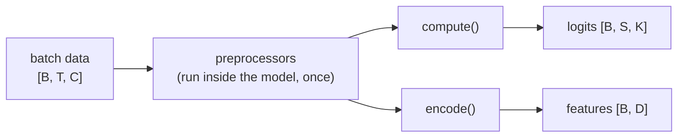

# Models: classification and embeddings

A Sleepwalker model is a `torch.nn.Module` that consumes the dataset's `[B, T, C]` batch and produces either classification logits or feature vectors — usually both. This page explains the input contract, what each capability promises, where preprocessors run, and how to pick or write a model. The generated class reference is in [Models reference](../reference/models.md).

## The input contract

Every model receives a float tensor of shape

$$
x \in \mathbb{R}^{B \times T \times C},
$$

ordered **batch–time–channel** (the `"BTC"` layout). \(T\) is fixed by the dataset: \(T = \operatorname{round}(\texttt{total\_input} \cdot f_s)\), e.g. 3000 for a 30 s window at 100 Hz. \(C\) is the number of *logical* channels from the dataset's `ChannelConfig`s — the model never sees raw EDF channel names.

Each model declares this contract through `input_spec()`, which returns `(shape, meta)` with the full shape including the batch dimension and metadata like `layout`, `ts_len`, and `n_channels`. The CLI checks the declaration against the dataset before training starts and fails with a clear error if the model expects a different time length, channel count, or layout — so a model and a dataset cannot silently disagree.

## Two capabilities



*`forward()` routes through `compute()` and yields logits; `features()` routes through `encode()` and yields embeddings. Both run the same preprocessors first. In most models `compute()` is a head applied on top of `encode()`.*

### Classification: `ClassifierModel`

A model that mixes in [`ClassifierModel`](../reference/models.md#classifier-model) promises that its normal `forward()` output is classification logits of shape `[B, S, K]`: \(S =\) `sequence_len` steps and \(K =\) the number of classes. `sequence_len=1` gives one label per window; \(S>1\) gives several center-aligned steps per window, which state-of-the-art staging models use to capture context between epochs. The loss and masking semantics for these tensors are in [From windows to class labels](train-multiclass.md#from-windows-to-class-labels).

### Embeddings: `EmbeddingModel`

A model that mixes in [`EmbeddingModel`](../reference/models.md#embedding-model) implements `encode(x)` for an already-preprocessed tensor and `feature_dim() -> int`. Calling `features(x)` runs the preprocessors and `encode()` and returns a `[B, D]` feature vector per window:

```python
import torch

from sleepwalker.models.TinySleepNet import TinySleepNet

model = TinySleepNet(ts_len=3000, n_channels=1, seq_len=3, sampling_frequency=100)
x = torch.randn(8, 3000, 1)

logits = model(x)          # [8, sequence_len, classes]  (needs classes=...)
features = model.features(x)  # [8, D] — D = model.feature_dim()
```

Embeddings are window-level: one vector per input window, with no class semantics attached. To score a recording with them, see [Extract embeddings](extract-embeddings.md).

!!! note "A package advertises its capabilities"
    `PackagedModel.capabilities` reports `["classification"]`, `["embeddings"]`, or both, based on the markers the packaged model implements. Check it before calling `features()` on a package.

## Preprocessors run inside the model

`BaseModel.forward()` is `compute(apply_preprocessors(x))`. Preprocessors are `nn.Module`s stored on the model — spectrograms, normalization, robust scaling — and they transform the tensor between the dataloader and the architecture. This has three practical consequences:

1. **The dataset delivers raw `[B, T, C]` signal; the model decides its own input representation.** `SleepTransformer` ships a `Spectrogram` + `Normalize` pair and never sees raw samples; `USleep` ships a `RobustScaler`. You configure them in the model section of the YAML, not in the dataset.
2. **Warmup is the trainer's job.** Before the first update, the trainer streams the training loader through every preprocessor whose `requires_warmup()` returns true so statistics (quantiles, means) are fitted on training data, on `warmup_device`. See [What happens inside fit()](train-multiclass.md#what-happens-inside-fit).
3. **`features()` includes preprocessing.** Never pre-process the tensor yourself before calling `features()` — pass the dataset's `data` directly.

The available preprocessors (`Spectrogram`, `WindowedSpectrogram`, `Normalize`, `NormalizeAlongDim`, `RobustScaler`, `EmpiricalClipScaler`, `FixedChannelStandardizer`, `Crop`) are documented in the [preprocessors reference](../reference/models.md#preprocessors).

## Choosing a model

| Situation | Pick | Why |
| --- | --- | --- |
| Baseline staging, raw waveform | `TinySleepNet` | Small, no preprocessing, fast to train. |
| Paper-faithful staging baselines | `AttnSleep`, `SeqSleepNet`, `MRASleepNet` | Reproduce published architectures with their built-in spectrogram pipelines. |
| Long windows, hierarchical context | `SleepTransformer` | Frame-level + epoch-level attention. |
| Many channels, temporal U-net | `USleep` | Built-in robust scaling for heterogeneous channels. |
| Event tasks at fine resolution (apnea, desaturation) | `UTime` | Per-epoch output via `epoch_len`; used by the breathing configs. |
| Self-supervised pretraining | `MaskedAutoencoder`, `CLSMaskedAutoencoder` | Reconstruction objectives; modality-keyed inputs (not `BaseModel`). |
| Reuse a pretrained package as a backbone | `PackagedClassifierModel`, `PackagedSequenceClassifierModel` | Frozen encoder + trainable head; see below. |
| Released foundation embeddings | `SleepFM`, `OSF` | Native model classes with verified weights; see [Use foundation models](foundation-models.md). |
| One encoder, several task heads | `MultiTaskClassifierModel` | Shared features with a separate output contract per task; pairs with `MultiLabelTrainer`. |
| Several packaged experts | `StackedClassifierModel` | Aligns native expert predictions and learns task corrections; pairs with `PairedDataset`. |

All models are selected in YAML by fully qualified path, and the CLI injects `classes`, `ts_len`, `n_channels`, `sampling_frequency`, and `sequence_len` from the dataset context:

```yaml
model:
  name: sleepwalker.models.UTime.UTime
  channel: [64, 128, 128, 256]
  kernel: [5, 5, 3, 3]
  preprocessors:
    - name: sleepwalker.models.preprocessors.RobustScaler.RobustScaler
      lower_quantile: 0.1
      upper_quantile: 0.9
```

## Reusing pretrained packages as backbones

A trained or downloaded package can serve as the encoder of a new model instead of retraining from scratch:

- [`SleepFM`](../reference/models.md#sleepfm) and [`OSF`](../reference/models.md#osf) use the same model interfaces, with optional released checkpoints. Export them with `save_packaged_model()` and a matching dataset; see [Use foundation models](foundation-models.md).
- [`PackagedEmbeddingModel`](../reference/models.md#packaged-embedding-model) adapts other external encoders to the embedding API.
- [`PackagedClassifierModel`](../reference/models.md#packaged-classifier-model) slides the package's native window over a longer input, calls `encoder.features()` per window (frozen by default), concatenates, and trains a linear or MLP head to `[B, S, K]` logits.
- [`PackagedSequenceClassifierModel`](../reference/models.md#packaged-sequence-classifier-model) applies a position-wise head over the encoder's token sequence for per-step predictions.

```python
from sleepwalker.models.PackagedClassifierModel import PackagedClassifierModel

model = PackagedClassifierModel(
    package="artifacts/foundation-encoder",
    classes=["wake", "n1", "n2", "n3", "rem"],
    ts_len=9000,
    sequence_len=3,
    freeze_encoder=True,
    head="linear",
)
```

## Writing your own model

Subclass `BaseModel`, add the capability markers, implement `compute()`, and declare `input_spec()`:

```python
import torch
import torch.nn as nn

from sleepwalker.models.BaseModel import BaseModel, ClassifierModel, EmbeddingModel


class MyStager(BaseModel, EmbeddingModel, ClassifierModel):
    def __init__(self, ts_len, n_channels, classes, preprocessors=None):
        super().__init__(preprocessors=preprocessors)
        self.classes = list(classes)
        self.backbone = nn.Sequential(
            nn.Conv1d(n_channels, 32, 64), nn.ReLU(), nn.AdaptiveAvgPool1d(1)
        )
        self.head = nn.Linear(32, len(self.classes))

    def encode(self, x):                      # x already preprocessed [B, T, C]
        return self.backbone(x.transpose(1, 2))  # [B, 32, 1]

    def feature_dim(self):
        return 32

    def compute(self, x):                    # called by forward() after preprocessors
        return self.head(self.encode(x).flatten(1)).unsqueeze(1)  # [B, 1, K]

    def input_spec(self):
        return (1, ts_len, n_channels), {"layout": "BTC", "ts_len": ts_len, "n_channels": n_channels}
```

Keep the class order identical to the dataset's `output_classes` / `target_classes` — index \(k\) of your logits must be the \(k\)-th class everywhere, as warned in [Train a multiclass model](train-multiclass.md).

!!! warning "MaskedAutoencoder is different"
    `MaskedAutoencoder` is a plain `nn.Module` with **modality-keyed** preprocessors and calls (`forward(x, modality)`, `embed(x, modality)`). It does not follow the `BaseModel` contract and is trained with `MaskedAutoencoderTrainer`, not the classification trainers.
