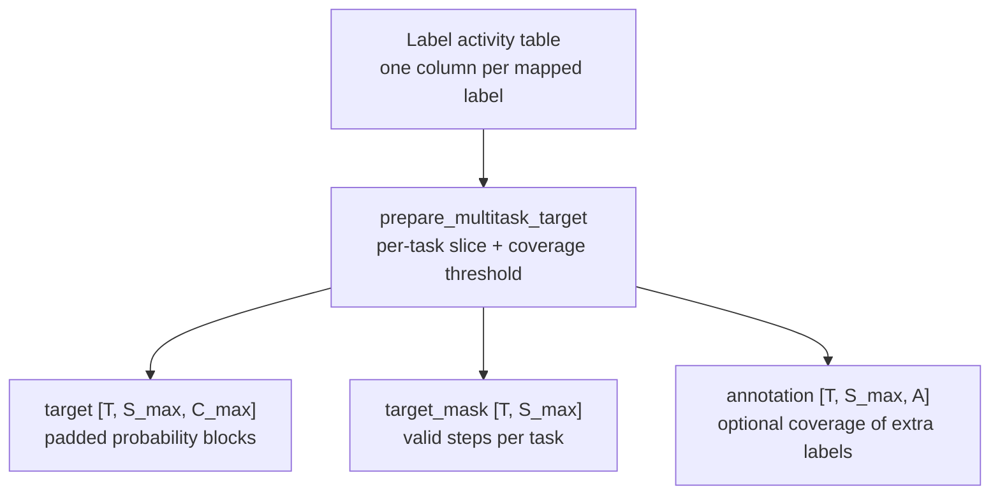

# Multilabel targets

Annotation data is multi-label by nature: during one night a patient can be in sleep stage `n2`, have an apnea, and move a leg at the same time. A single softmax head cannot express that, because it forces exactly one class per output step. Sleepwalker handles overlapping events with **tasks**: each task is an independent categorical problem with its own label set, its own temporal resolution, and its own loss, and one input window carries the targets of all tasks side by side. This page explains the task configuration, the padded target tensors, and the [`MultiLabelTrainer`](../reference/trainers.md#multilabel-trainer) that consumes them.

!!! note "Multiclass is the special case"
    The single-head staging pipeline in [Train a multiclass model](train-multiclass.md) is a multitask problem with exactly one task. If your labels are mutually exclusive and share one resolution, use `MulticlassTrainer` — it is simpler. Use the multitask path when labels from different domains overlap in time or need different resolutions.

## Task configuration

A multitask setup is described by a `task_config` dictionary that maps task names to their settings. Every consumer — the target builder, the trainer, and the prediction formatter — reads the same dictionary, so the tasks are defined once:

```python
import torch

task_config = {
    "sleep": {
        "labels": ["n1", "n2", "n3", "rem", "wake"],
        "default": "wake",
        "percentage": 0.5,
        "target_resolution": "30s",
        "sequence_len": 1,
        "loss_function": torch.nn.functional.cross_entropy,
        "loss_mode": "inverse",
    },
    "breathing": {
        "labels": ["apnea", "hypopnea", "regular"],
        "default": "regular",
        "percentage": 0.5,
        "target_resolution": "10s",
        "sequence_len": 3,
        "loss_function": torch.nn.functional.cross_entropy,
        "loss_mode": "inverse",
    },
}
```

The fields per task:

| Field | Default | Meaning |
| --- | --- | --- |
| `labels` | required | Class names of this task. A class may appear in **only one** task; `normalize_multitask_config` rejects duplicates. |
| `default` | required | The implicit negative class, or `None`. Its column is dropped before target construction, so "no event" needs no annotation. |
| `percentage` | `0.5` | A class must cover at least this fraction of a step to win the step, as in [`prepare_multiclass_target`](../reference/api.md#prepare-multiclass-target). |
| `target_resolution` | required | Real-time duration covered by one output step of this task. |
| `sequence_len` | required | Number of steps this task predicts per input window. |
| `soft_boundaries` | `False` | Emit coverage-probability targets instead of thresholded one-hots. |
| `step_mask` | `None` | `{columns, percentage}` specification that marks which steps are valid for this task. |
| `loss_function` | required by the trainer | Callable, typically `torch.nn.functional.cross_entropy`. |
| `loss_mode` | `"none"` | Class reweighting: `"inverse"`, `"inverse-log"`, or `"none"` (same semantics as in [Class imbalance](train-multiclass.md#class-imbalance)). |
| `class_weights` | `{}` | Manual per-class weight multipliers. |
| `class_counts` | `None` | Known class frequencies; skips the warmup estimation pass for this task. |
| `task_weight` | `1.0` | Multiplier on this task's loss before averaging across tasks. |

[`normalize_multitask_config(task_config)`](../reference/trainers.md#normalize-multitask-config) validates all of this and derives two quantities per task: the **target span**

$$
\text{span}_t = \texttt{target\_resolution}_t \times \texttt{sequence\_len}_t,
$$

and the **target offset**. Tasks with different spans are centered inside the largest span:

$$
\texttt{target\_offset}_t = \frac{\max_{t'} \text{span}_{t'} - \text{span}_t}{2},
$$

unless an explicit `target_offset` is configured. For the example above, `sleep` spans 30 s and `breathing` spans \(3 \times 10\,\mathrm{s} = 30\,\mathrm{s}\), so both are centered with offset 0 inside the common 30 s supervised region of the input window.

## The padded target tensor

Tasks have different numbers of steps and classes, so the targets are stored in one padded tensor. With \(T\) tasks, \(S_\max = \max_t \texttt{sequence\_len}_t\), and \(C_\max = \max_t |\text{labels}_t|\):

$$
y \in \mathbb{R}^{T \times S_\max \times C_\max}, \qquad m \in \{0,1\}^{T \times S_\max}.
$$

Task \(t\) writes its \([S_t, C_t]\) block into the top-left corner of its slice; the rest stays zero and the mask marks which steps are valid. For the example above, `S_max = 3` and `C_max = 5`:

| Slice | Task | Block written | Mask length |
| --- | --- | --- | --- |
| `y[0]` | `sleep` | `[1, 5]` (one 30 s step, five stages) | `m[0]` = 1 |
| `y[1]` | `breathing` | `[3, 3]` (three 10 s steps, three classes) | `m[1]` = 3 |



[`prepare_multitask_target`](../reference/trainers.md#prepare-multitask-target) is the dataset-side callback that produces these tensors. Wire it into a dataset like any other `prepare_target`:

```python
from functools import partial

from sleepwalker.trainer.utils.targets import normalize_multitask_config, prepare_multitask_target

normalized = normalize_multitask_config(task_config)

dataset = SleepEDFx(
    ...,
    prepare_target=partial(prepare_multitask_target, task_config=normalized),
)
```

It returns `{"target": y, "target_mask": m}` per item, plus `annotation` if `annotation_labels` are requested and `target_extra`/`target_extra_mask` when the adapter provides a second annotation timeline. A window is rejected (returns `None`) only if **no** task can be resolved; with `allow_partial=True`, unresolvable tasks keep their zero block and a false mask instead of rejecting the whole window. If `class_cnts` are supplied, the callback also applies frequency-based subsampling: an item is kept with probability \(\min_t \, p_{\min}^{(t)} / p_{y}^{(t)}\), the same balancing idea as `balance_batches` but applied per task.

## MultiLabelTrainer

[`MultiLabelTrainer`](../reference/trainers.md#multilabel-trainer) trains one model that emits a **dictionary of logits**, one entry per task:

```python
# model(x) must return, for the example tasks:
{
    "sleep":     tensor [B, 1, 5],   # [B, sequence_len, n_classes]
    "breathing": tensor [B, 3, 3],
}
```

The trainer slices the padded target with the same geometry and validates every batch: `logits[task]` must match `[B, n_steps, n_classes]`, the sliced target must match, and every valid target row must sum to one. For each task with at least one valid step it computes

$$
\mathcal{L}_t = w_t \cdot \ell_t\!\left(z_t[m_t],\, y_t[m_t]\right),
$$

where \(\ell_t\) is the task's (possibly class-weighted) loss, \(m_t\) the task's step mask, and \(w_t\) the `task_weight`. The total loss is the unweighted mean over the tasks that contributed:

$$
\mathcal{L} = \frac{1}{|\text{active tasks}|} \sum_{t \in \text{active}} \mathcal{L}_t.
$$

Gradients, validation cadence, best-epoch selection, and checkpointing work exactly as in the base trainer (see [What happens inside fit()](train-multiclass.md#what-happens-inside-fit)). Metrics are computed per task from each task's confusion matrix and reported as means across tasks: accuracy, micro/macro F1, and Cohen's \(\kappa\), plus one confusion matrix per task.

### Conditioning one task on another

Because tasks share the batch, one task's labels can gate another task's loss. `condition_task`, `condition_labels`, and `conditioned_tasks` express rules like *"score breathing events only in windows that contain sleep"*:

```python
trainer = MultiLabelTrainer(
    epochs=30,
    optimizer=lambda model: torch.optim.Adam(model.parameters(), lr=1e-3),
    task_config=normalized,
    condition_task="sleep",
    condition_labels=["n1", "n2", "n3", "rem"],
    conditioned_tasks=["breathing"],
)
```

Per sample, the gate is

$$
g_b = \bigvee_{s} \left[ \arg\max_k y_{b,\text{sleep},s,k} \in \texttt{condition\_labels} \;\wedge\; m_{b,\text{sleep},s} \right],
\qquad
m_{b,\text{breathing}} \leftarrow m_{b,\text{breathing}} \wedge g_b,
$$

so breathing steps contribute to loss and metrics only in samples whose sleep task is labeled as asleep. The condition task itself is always trained unconditionally.

## The multitask contract

`trainer.classification_contract()` records the full task layout so a package can turn logits back into named, timestamped predictions:

```python
{
    "type": "multitask",
    "tasks": {
        "sleep": {
            "classes": ["n1", "n2", "n3", "rem", "wake"],
            "n_steps": 1,
            "target_resolution": "0 days 00:00:30",
            "target_offset": "0 days 00:00:00",
            "default": "wake",
            "percentage": 0.5,
            "soft_boundaries": False,
        },
        "breathing": { ... },
    },
}
```

Prediction formatting emits one row per task and step with a `task` column, so a multitask prediction table interleaves sleep-stage rows and breathing rows for the same recording. See [Import and export model packages](package-import-export.md) for how the contract travels with the package.

!!! warning "The model must return a task dictionary"
    `MultiLabelTrainer` reads `logits[task]`, so the model's `compute()` must return a `dict` keyed by the exact task names in `task_config` — a plain logits tensor will fail. The library provides this shape through [`ModelGraphClassifier`](../reference/models.md#modelgraphclassifier), which assembles task logits from a graph of packaged nodes; for a hand-written model you return the dict yourself. There is currently **no YAML example** in `configs/` that trains `MultiLabelTrainer` end to end, and the trainer-side batch balancing is rejected for numpy caches. <!-- TODO: add a verified end-to-end multitask example (dataset + two-head model + MultiLabelTrainer) and a YAML configuration for it. See the [roadmap](../roadmap.md#document-multitask-targets). -->
