---
hide:
  - toc
---

# How Sleepwalker works


Sleepwalker loads [EDF recordings](data.md), [trains your own models](train-multiclass.md), and [runs pretrained packages on new recordings](predict-patient.md) — at terabyte scale on commodity hardware. If you want to extend Sleepwalker or debug a run, the thing to understand is its **data flow model**: a single training step touches an EDF reader, unit conversion, resampling, a normalizer, dataset callbacks, a collate function, model preprocessors, the model, a loss, and finally an exported package. This page is a map of that flow — which module owns each step, and *when* it runs — so you know where to look when a shape or a value is wrong. Each step links to the how-to that goes deep.

## The data flow

```mermaid
%%{init: {"themeVariables": {"noteBkgColor": "#0d1b34", "noteBorderColor": "#33507e", "noteTextColor": "#9ecbff", "noteFontFamily": "ui-monospace, 'DejaVu Sans Mono', monospace"}}}%%
sequenceDiagram
    participant R as run() / RunCfg
    participant T as Trainer
    participant M as Model
    participant DL as DataLoader
    participant DS as Dataset
    participant EDF as EDF reader
    participant NZ as Normalizer
    participant CB as Callbacks

    rect rgb(16, 32, 60)
    Note over R,CB: SETUP - eager, once (Run.py)
    R->>DS: initialize(paths)
    DS-->>R: window grid + label index - no signal in RAM
    R->>DL: build_loader(dataset, collate_fn, workers)
    R->>T: fit(model, train_loader, val_loader)
    T->>M: warmup - stream data through preprocessors
    end

    rect rgb(9, 18, 38)
    loop every batch - Trainer pulls, workers produce
        T->>DL: next batch
        loop every window idx - lazy, inside a worker
            DL->>DS: dataset[idx]
            DS->>CB: prepare_target(labels)
            Note over DS,CB: cheap reject before any signal is read
            DS->>EDF: readSignal(start, n)
            EDF-->>DS: raw int16 samples
            DS->>DS: unit convert + resample
            DS->>NZ: normalize(window)
            NZ-->>DS: scaled window
            DS->>CB: prepare_sample(window)
            DS-->>DL: sample dict
            Note over DS: data [T, C] / target / patient / time
        end
        DL->>DL: batch_collate
        Note over DL: batch [B, T, C]
        DL-->>T: batch
        T->>M: forward(x)
        M->>M: apply_preprocessors then compute
        M-->>T: logits [B, S, K]
        T->>T: loss + optimizer step
    end
    end

    rect rgb(16, 32, 60)
    Note over R: EXPORT - once, after fit (deployment/package.py)
    R->>R: save_packaged_model(model, dataset, contract)
    end
```



*Time flows downward. The shaded bands are eager work that happens once; everything inside the loop is lazy and runs per window inside DataLoader worker processes. The monospace notes mark the tensor produced at each hand-off.*

## Two phases: eager setup, lazy windows

The single most important thing to internalize: **only `initialize()` is eager.** It reads EDF headers and annotations and builds the window grid — no signal values are held in memory. Everything expensive per window — `readSignal`, unit conversion, resampling, normalization, the `prepare_*` callbacks — is deferred to `dataset[idx]`, which runs inside DataLoader workers at batch-assembly time. That is why a cohort of terabytes fits in RAM: the data stays on disk and is materialized one window at a time. It also means a bug in a normalizer or callback surfaces during training, not during `initialize()`. See [What happens when a dataset is initialized](data.md#what-happens-when-a-dataset-is-initialized) and [Tune data loading performance](performance.md).

## Reading the map

| Step | Lives in | Produces | Go deeper |
| --- | --- | --- | --- |
| `run()` / `RunCfg` | `trainer/Run.py` | assembles model, datasets, trainer, loaders | [RunCfg and the CLI](runcfg-cli.md) |
| `initialize()` | `datasets/BaseDataset.py` | window grid + label index (no signal) | [Load some data](data.md) |
| `dataset[idx]` (lazy) | `datasets/BaseDataset.py`, `EDFFile` | one window: read → unit convert → resample → normalize | [Windowing of EDF files](data.md#windowing-of-edf-files) |
| `prepare_target` / `prepare_sample` | `trainer/utils/targets.py`, `training/callbacks` | label + quality checks; may reject the window | [Multilabel targets](multilabel.md) · [What rejection costs](train-multiclass.md#what-rejection-costs) |
| `batch_collate` | `training/loader.py` | `[B, T, C]` batch | [Data loading reference](../reference/loading.md) |
| `forward()` | `models/BaseModel.py` | preprocessors + `compute` → logits `[B, S, K]` | [Models: classification and embeddings](models.md) |
| loss + step | `trainer/BaseTrainer.py` | gradients, optimizer, metrics | [Train a multiclass model](train-multiclass.md) |
| `save_packaged_model()` | `deployment/package.py` | reproducible inference package | [Import and export model packages](package-import-export.md) |

## RunCfg

`RunCfg` is the input to the **SETUP** band above: every field is an already-built object or a plain value, and `run()` never inspects a loss function or optimizer because those live inside the trainer. A minimal run:

```python
from sleepwalker.datasets import batch_collate
from sleepwalker.trainer.Run import RunCfg, run

cfg = RunCfg(
    experiment_name="my-run",
    model_name="attnsleep",
    model=model,                       # torch.nn.Module
    trainer=trainer,                   # owns loss, optimizer, schedule
    train_datasets=[train_ds],
    val_datasets=[val_ds],
    test_datasets=[("heldout", test_ds)],
    batch_size=32,
    n_samples=100_000,
    num_workers_dataloader=8,
    collate_fn=batch_collate,
)
result = run(cfg)
```

The full field list, the `run()` execution order, and the YAML/CLI equivalent are in [RunCfg and the CLI](runcfg-cli.md).

## Shapes at every stage

| Stage | Object | Shape | Example (30 s, 100 Hz, 1 EEG, B=32, S=1, K=5) |
| --- | --- | --- | --- |
| Window read | `x_df` | `[T, C]` (native fs before resample) | `[3000, 1]` |
| Sample | `item["data"]` | `[T, C]` float tensor | `[3000, 1]` |
| Batch | `batch["data"]` | `[B, T, C]` | `[32, 3000, 1]` |
| Model logits | `model(x)` | `[B, S, K]` | `[32, 1, 5]` |
| Embedding | `model.features(x)` | `[B, D]` | `[32, 256]` |
| Multiclass target | `item["target"]` | `[S, K]` | `[1, 5]` |
| Multitask target | `item["target"]` | `[T_tasks, S_max, C_max]` | `[2, 3, 5]` |
| Multitask mask | `item["target_mask"]` | `[T_tasks, S_max]` | `[2, 3]` |

## Where the knobs live

| Concern | Knob | Page |
| --- | --- | --- |
| Which EDF channels, units, filtering | `ChannelConfig`, normalizers | [Load some data](data.md) |
| Window length, stride, rejection | `total_input`, `stride`, `rejection_strategy` | [Load some data](data.md) |
| I/O and CPU throughput | `num_workers`, thread caps, `PatientSampler`, `NumpyDataset` | [Performance](performance.md) |
| Model input representation | model `preprocessors` | [Models](models.md) |
| Loss, weighting, imbalance | trainer `loss_function`, `loss_mode`, `class_weights` | [Train a multiclass model](train-multiclass.md) |
| Several overlapping label sets | `task_config`, `MultiLabelTrainer` | [Multilabel targets](multilabel.md) |
| Reproducible deployment | `PackagedModel`, contracts | [Import and export model packages](package-import-export.md) |
