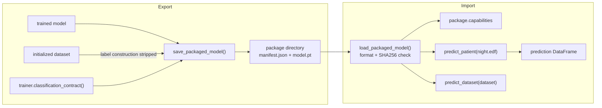

# Import and export model packages

A model checkpoint alone cannot interpret an EDF: prediction also depends on the expected channels, units, sampling frequency, normalization, window geometry, and class order. A **model package** freezes all of that together with the weights into a directory that can be shipped and loaded elsewhere. The conceptual design — what the manifest means and why the package carries a dataset — is covered in [Model packages](packaged-model.md); this page is the task guide: how to create a package from your training, and how to load one and predict.



## Exporting a package

### From Python

[`save_packaged_model()`](../reference/api.md#save-packaged-model) takes the three ingredients explicitly and writes the package directory:

```python
from sleepwalker.deployment import save_packaged_model

package = save_packaged_model(
    "artifacts/my-stager",
    name="my-stager",
    model=model,                                   # trained torch.nn.Module
    dataset=train_dataset,                         # initialized dataset object
    classification_contract=trainer.classification_contract(),
    task="sleep",
    config={"trained_on": "Sleep-EDFx SC", "notes": "example run"},
)
```

What happens inside:

1. The dataset is converted to an **unlabelled inference template** (`UnlabelledDataset.from_dataset(...)`), so the package keeps the EDF preprocessing configuration — channels, units, resampling, normalizers, windowing — but never builds training targets. For a `MultiDataset`, the first constituent is used as the deployment template.
2. `classification_contract` and `config` are passed through a JSON-compatibility filter, so only serializable metadata lands in the manifest.
3. `git_commit` defaults to the current `git rev-parse HEAD`, recording the source revision that produced the package.
4. `package.save(path)` writes `model.pt` (the whole `PackagedModel` pickled with cloudpickle) and `manifest.json` (with the SHA256 of `model.pt`).

The constructor validates the combination before anything is written: the model must be a `torch.nn.Module` that declares itself a `ClassifierModel` or `EmbeddingModel`; a `ClassifierModel` **requires** a contract; a `single-head-multiclass` contract requires a `task` name and a positive `target_resolution`; and the model's declared `input_spec()` must match the dataset's time length and channel count. A package that would misalign model and data cannot be created in the first place.

### From a training run

If you train through `run()` / the CLI, the package is exported automatically at the end of the run (see [RunCfg and the CLI](runcfg-cli.md)): `export_final_model()` calls `save_packaged_model()` with `task = expert_task or model_name`, the trainer's contract, and the run's `meta_data` as `config`. The package lands in the run directory as `final/package/`, and additionally at `package_path` if you set it:

```yaml
run:
  experiment_name: sleep-edfx-attnsleep
  export_package: true
  package_path: artifacts/sleep-edfx-attnsleep
```

Set `export_package: false` to train without producing a package.

### Embedding-only packages

A package whose model implements `EmbeddingModel` but not `ClassifierModel` needs no contract — `classification_contract=None` is valid, and `package.capabilities` reports `["embeddings"]`. Export `SleepFM` or `OSF` directly with `save_packaged_model()` and a matching dataset; see [Use foundation models](foundation-models.md). You can then use the embeddings downstream as shown in [Extract embeddings](extract-embeddings.md) or build a new head on top via [`PackagedClassifierModel`](../reference/models.md#packaged-classifier-model).

## Importing a package

### Load and inspect

[`load_packaged_model(path, map_location=...)`](../reference/api.md#load-packaged-model) is the entry point:

```python
from sleepwalker.deployment import load_packaged_model

package = load_packaged_model("artifacts/my-stager", map_location="cpu")

print(package.capabilities)          # ['classification'] or ['embeddings'] or both
print(package.task)                  # 'sleep'
print(package.classification_contract["classes"])
```

Loading performs three gates before deserializing the payload: the `format_version` in `manifest.json` must match the library's expected version, the recomputed SHA256 of `model.pt` must match the manifest, and the payload must unpickle to a `PackagedModel`. The manifest itself is plain JSON and can be read without loading any model code — see [Inspect a model package](inspect-package.md) and the [package manifest reference](../reference/package-manifest.md).

### Predict one recording

`predict_patient()` clones the packaged dataset template, initializes it on a single EDF, and runs the model over its windows:

```python
predictions = package.predict_patient(
    "recordings/night.edf",
    batch_size=64,
    num_workers_dataset=0,
    num_workers_loader=0,
    device="cpu",
)
predictions.to_csv("night-predictions.csv", index=False)
```

The returned DataFrame has one row per output step: `patient`, `task`, `time`, `prediction_idx`, `prediction`, and one `prob__<class>` column per class. Timing comes from the contract: each step's timestamp is the window start plus `target_offset` plus the step index scaled by the target resolution. A fresh dataset clone is used per call, so patient state never leaks between recordings, and missing source channels fail during initialization. Unit processors reject an alias during recording fitting or window access, depending on where the step runs. The full walkthrough is in [Predict sleep stages](predict-patient.md).

### Predict a prepared dataset

To score a dataset you configured yourself — a different cohort, different windowing — use `predict_dataset()`. It first checks that your dataset matches the package's inference contract:

```python
my_dataset.initialize(patient_paths, num_workers=4, strict=True)
package.assert_compatible(my_dataset)          # channels, sampling, window geometry, normalization
predictions = package.predict_dataset(my_dataset, batch_size=128, device="cuda:0")
```

`assert_compatible()` compares logical channel order, sampling frequency, resample type, input duration, and stride. Processor functions can change values and units dynamically; callers are responsible for preprocessing comparability. With `return_received_windows=True` you also get a counter of received vs. expected windows, which is how coverage gaps in long recordings become visible.

!!! warning "Loading a package executes code"
    `model.pt` uses Python/PyTorch serialization with `weights_only=False` because the package contains executable objects: normalizers, callbacks, and the model class itself. The SHA256 digest detects accidental modification but **is not a security mechanism** — an attacker who edits `model.pt` can rewrite the digest. Load packages only from sources you trust, in environments you control.

## Checkpoints vs packages

| | Checkpoint (`final/checkpoint.pt`) | Package (`final/package/`) |
| --- | --- | --- |
| Contains | trainer state, optimizer, scheduler, RNG, weights | model + inference dataset template + contract + manifest |
| Purpose | resume training with `sleepwalker resume` | inference and distribution |
| Carries preprocessing contract | no (rebuilt from `hparams.yml`) | yes |
| Can predict EDFs | no | yes |

Use the checkpoint to continue optimization; use the package for everything else. See [Checkpoints and packages serve different purposes](packaged-model.md#checkpoints-and-packages-serve-different-purposes).
