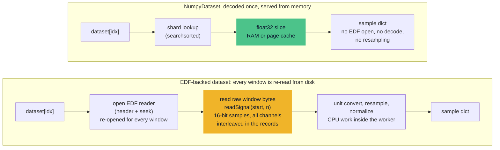

# Performance

A sleep model spends most of its life moving windows of signal from disk to GPU. One night recording is a few hundred megabytes, and one training epoch requests hundreds of thousands of windows, so the bottleneck is usually disk I/O and CPU-side decoding rather than the model itself. This page explains where the cost comes from and which knobs Sleepwalker provides: worker processes and thread limits, the `PatientSampler`, and the fully in-memory `NumpyDataset`.

The design target is terabytes of recordings: cohorts of thousands of patients, each with several nights and many channels, far larger than fit in memory. The techniques below are what make a full training run over that much data finish in hours rather than days.

## Every window is read from disk

As explained in [loading data](data.md), `initialize()` stores only metadata: patient descriptors, label indices, and window start positions. Signal values stay on disk. Each call to `dataset[idx]` resolves the index to a patient and a window start, and `EDFFile.get_x` reads that window through `edf_to_df`, which opens a fresh `pyedflib.EdfReader`, seeks to the sample offset of the window, reads the raw samples, and closes the handle again. Nothing is cached between calls.

The EDF format shapes what "reading a window" costs. EDF stores samples as 16-bit integers grouped into fixed-duration data records, and every record contains all channels back to back. Reading one channel over a window therefore means many small strided reads — one slice per record — rather than one contiguous block. For a window of duration \(L\) and a channel sampled at \(f_c\), the channel contributes

$$
B_c = 2 \cdot L \cdot f_c
$$

bytes, because each stored sample is two bytes. A 30-second window with one 100 Hz EEG channel and one 1 Hz EMG channel touches roughly

$$
2 \cdot 30 \cdot (100 + 1) \approx 6\,\text{kB}.
$$

That is small per window, but the access pattern is random: with `n_samples=250{,}000` windows per epoch, the loader issues roughly 1.5 GB of small random reads scattered across every file in the cohort, plus one file open and close per window. Small random reads and per-file open latency — especially on a networked file system — are what limit throughput, not raw bandwidth.



*The lazy EDF path re-opens and re-decodes for every window. `NumpyDataset` skips the decode entirely.*

!!! warning "Data loading pressures I/O bandwidth"
    Keep recordings on local NVMe/SSD storage rather than on a network share. The same pipeline that saturates a local SSD can stall for orders of magnitude longer on NFS with millisecond-level latency per open and read. See also the warning in [loading data](data.md).

Initialization has its own cost profile. `initialize()` reads only EDF headers and annotation files, which is cheap and parallelized across `num_workers` processes. The exception is `z_normalize=True`: the dataset then loads every complete recording once during initialization to compute per-recording mean and standard deviation. For large cohorts, that single full pass can dominate startup; filter patients with [`get_patient_stats()`](../reference/api.md#base-dataset) first if you only need a subset.

<!-- TODO: `EDFFile` carries a `handle` field, but `get_x` passes the file *path* to `edf_to_df`, so every window access opens and closes a new `pyedflib.EdfReader`. Reusing one open handle per worker would remove the per-window open/close overhead. See the [roadmap](../roadmap.md#reuse-open-edf-reader-handles). -->

## Simple knobs: workers and threads

There are two unrelated `num_workers` settings, and both matter.

**Initialization workers.** `dataset.initialize(patients, num_workers=8)` runs header parsing, unit validation, and annotation mapping in a `multiprocessing.Pool` over the patient list. This shortens startup only; it does not affect per-window loading.

**DataLoader workers.** The loader's `num_workers` controls how many processes materialize windows in parallel while the GPU consumes already-prepared batches. [`build_loader()`](../reference/api.md#build-loader) sets this up for you: whenever `num_workers > 0`, it enables `persistent_workers=True` (workers survive across epochs and keep their dataset copy), `prefetch_factor=2` (each worker keeps two batches in flight), and `pin_memory=True` (batches land in page-locked memory for fast host-to-device transfer).

The goal is to hide sample preparation behind GPU compute. If one window takes \(t_\text{cpu}\) seconds to read and normalize, and one training step takes \(t_\text{gpu}\) seconds, the GPU stays busy only if the worker pool produces faster than the GPU consumes:

$$
\frac{W}{t_\text{cpu}} \ge \frac{1}{t_\text{gpu}}
\quad\Longleftrightarrow\quad
W \ge \frac{t_\text{cpu}}{t_\text{gpu}}.
$$

Measure both by timing the loader loop with and without a training step, then pick \(W\) with some headroom. A typical starting point on a workstation is 8–16 workers:

```python
loader = build_loader(
    dataset,
    batch_size=32,
    num_workers=8,
    n_samples=100_000,
    collate_fn=batch_collate,
    sampling="random",
    seed=0,
    rejection_strategy="none",
)
```

**Thread oversubscription.** Every DataLoader worker is a full Python process, and NumPy, SciPy, and MKL default to one compute thread per core. With 16 workers on a 16-core machine you get 256 threads fighting for 16 cores, and the resampling and filtering inside each window suffer. Cap the numeric libraries to a small thread count *before importing NumPy or PyTorch*:

```python
import os

os.environ["OMP_NUM_THREADS"] = "2"
os.environ["MKL_NUM_THREADS"] = "2"
os.environ["OPENBLAS_NUM_THREADS"] = "2"
```

These are the values the research training scripts use. The environment variables must be set before the numeric libraries are imported, because they are read once at import time; `torch.set_num_threads(2)` covers PyTorch operations afterwards but not NumPy. The right value is a trade-off: with many workers, 1–2 threads per worker is usually best; with few workers, more threads per worker speed up the polyphase resampling and Butterworth filtering.

<!-- TODO: the thread caps above are set ad hoc in the legacy research scripts; the library itself provides no supported helper. A small documented utility (e.g. `sleepwalker.utils.set_thread_limits(threads_per_worker=2)`) that must be called before import would remove a common footgun. See the [roadmap](../roadmap.md#provide-a-supported-thread-limit-helper). -->

## PatientSampler: fewer files per epoch

With uniform random sampling, every batch can touch a different patient, so a large cohort is re-opened and re-read cold every epoch. The [`PatientSampler`](../reference/api.md#build-loader) restricts each epoch to a small subset of patients and rotates the subset across epochs. Fewer distinct files per epoch means the operating system's page cache stays warm and reads become memory hits.

The sampler needs a dataset that exposes `get_patient_ranges()`, i.e. a partition of the window indices into contiguous per-patient blocks. For an epoch counter \(e\), a cohort of \(N\) patients, and `patients_per_epoch = P`, the sampler shuffles the patient order once and selects

$$
S_e = \left\{\, \pi\!\left((e \cdot P + i) \bmod N\right) \;:\; i = 0, \ldots, P-1 \,\right\},
$$

a rotating window over the shuffled order. The epoch's `num_samples` windows are split as evenly as possible over the \(P\) selected patients, and within a patient, windows are drawn without replacement until that patient's windows are exhausted. If \(P\) divides \(N\), every patient is seen exactly once every \(N/P\) epochs.

Selected patients are further split into locality groups of `patient_group_size` \(g\). Within a group, the per-patient index lists are interleaved round-robin, so consecutive batches draw from at most \(g\) files while the group stays active:

```python
loader = build_loader(
    dataset,
    batch_size=32,
    num_workers=8,
    n_samples=100_000,
    collate_fn=batch_collate,
    sampling="patient_balanced",
    seed=0,
    patients_per_epoch=32,
    patient_group_size=8,
)
```

If you omit `patient_group_size`, `build_loader` derives one as

$$
g = \min\!\left(P,\; \max\!\left(\min(16, B, P),\; \left\lceil \frac{2 \cdot W \cdot B \cdot P}{N_s} \right\rceil\right)\right),
$$

where \(B\) is the batch size, \(W\) the worker count, and \(N_s\) the number of samples per epoch. The ceiling term keeps enough files open to cover the prefetched batches (\(2W\) batches in flight), and the floor of 16 keeps batches diverse when the cohort is small.

```mermaid
block-beta
    columns 11
    l1["epoch 1"]
    e1c1["P7"] e1c2["P2"] e1c3["P9"] e1c4["P4"] e1c5["P0"] e1c6["P6"] e1c7["P1"] e1c8["P8"] e1c9["P3"] e1c10["P5"]
    l2["epoch 2"]
    e2c1["P0"] e2c2["P6"] e2c3["P1"] e2c4["P8"] e2c5["P3"] e2c6["P5"] e2c7["P7"] e2c8["P2"] e2c9["P9"] e2c10["P4"]
    l3["epoch 3"]
    e3c1["P3"] e3c2["P5"] e3c3["P7"] e3c4["P2"] e3c5["P9"] e3c6["P4"] e3c7["P0"] e3c8["P6"] e3c9["P1"] e3c10["P8"]
    l4["epoch 4"]
    e4c1["P9"] e4c2["P4"] e4c3["P0"] e4c4["P6"] e4c5["P1"] e4c6["P8"] e4c7["P3"] e4c8["P5"] e4c9["P7"] e4c10["P2"]

    classDef g1 fill:#5b9bf8,stroke:#5b9bf8,color:#0c172f
    classDef g2 fill:#2ec4c6,stroke:#2ec4c6,color:#0c172f
    classDef ghost fill:#16233f,stroke:#2a3a55,color:#5a6b85
    classDef lbl fill:none,stroke:none,color:#f0f4ff

    cssClass l1,l2,l3,l4 lbl
    cssClass e1c1,e1c2,e2c1,e2c2,e3c1,e3c2,e4c1,e4c2 g1
    cssClass e1c3,e1c4,e2c3,e2c4,e3c3,e3c4,e4c3,e4c4 g2
    cssClass e1c5,e1c6,e1c7,e1c8,e1c9,e1c10,e2c5,e2c6,e2c7,e2c8,e2c9,e2c10,e3c5,e3c6,e3c7,e3c8,e3c9,e3c10,e4c5,e4c6,e4c7,e4c8,e4c9,e4c10 ghost
```



*With `patients_per_epoch=4` and `patient_group_size=2`, each epoch reads only four of the ten files. Group 1 (blue) is read first, group 2 (teal) next; the six dimmed files are not touched that epoch, and the touched set rotates every epoch.*

!!! note "Rotate the sampler each epoch"
    The rotation depends on the epoch counter. `BaseTrainer.set_loader_epoch()` calls `sampler.set_epoch(epoch)` for you inside the training loop. If you drive a `patient_balanced` loader yourself, call `loader.sampler.set_epoch(epoch)` at the top of every epoch, otherwise every epoch replays the same patients.

!!! warning "Fewer patients means more correlated batches"
    Windows inside one locality group come from at most \(g\) patients. Batch statistics such as BatchNorm running means therefore see strongly correlated data. Keep \(g\) at or above the diversity floor and prefer larger groups when the GPU is not I/O limited.

## NumpyDataset: full in-memory data

The strongest optimization is to stop decoding altogether. [`export_dataloader_to_numpy_dir()`](../reference/datasets/NumpyDataset.md) runs the lazy EDF pipeline exactly once and writes the realized tensors to a directory of `.npy` files plus a `meta.json`:

```python
from sleepwalker.datasets.utils import export_dataloader_to_numpy_dir

cache_dir = export_dataloader_to_numpy_dir(
    loader,
    "cache/train_sleep_edfx",
    n_samples_per_file=50_000,
)
```

`n_samples_per_file` splits each array into shards (`data.000000.npy`, `data.000001.npy`, …) so no single file grows beyond a manageable size. The export captures exactly one realized loader pass, including any dataset-side randomization that happened during that pass.

[`NumpyDataset`](../reference/datasets/NumpyDataset.md) reads that directory back and serves items through the same dictionary interface, without ever touching an EDF file:

```python
from torch.utils.data import DataLoader

from sleepwalker.datasets.Basedataset import batch_collate
from sleepwalker.datasets.NumpyDataset import NumpyDataset

dataset = NumpyDataset(cache_dir, in_memory=True)
loader = DataLoader(
    dataset,
    batch_size=32,
    shuffle=True,
    num_workers=0,
    collate_fn=batch_collate,
)
```

The memory requirement is set by the cached arrays. With float32 data, \(N\) samples, \(T\) timesteps, and \(C\) channels,

$$
M \approx 4 \cdot N \cdot T \cdot C
$$

bytes for `data` alone. A common configuration — 250,000 windows of 30 s at 100 Hz with one channel — needs \(4 \cdot 250{,}000 \cdot 3000 \cdot 1 \approx 2.8\) GiB, plus targets and metadata. Check this against available RAM before caching.

`NumpyDataset` has two memory modes. `in_memory=True` loads the arrays fully into RAM and serving is a pure memory copy. `in_memory=False` uses `numpy.load(..., mmap_mode="r")`: the arrays stay on disk and the OS page cache decides what is resident. Memmap mode is a good middle ground when the cache is larger than RAM but the working set fits, but the first pass still reads from disk and you lose control over eviction.

!!! note "The cache freezes the data"
    Because the export realizes one loader pass, everything downstream of the dataset is frozen: targets, rejection decisions, and any randomness that produced the cached items. Online augmentation or a different `prepare_target` requires re-exporting. Extra fields must have a stable, numpy-serializable shape across all items; ragged payloads fail the export loudly.

!!! warning "Patient-balanced sampling is not available for caches"
    `NumpyDataset` does not implement `get_patient_ranges()`, so `build_loader(..., sampling="patient_balanced")` raises a `ValueError` on a cached dataset, and trainer-side batch balancing is rejected for numpy caches as well. With an in-memory cache this costs little I/O, but the sampling semantics differ from the EDF path. <!-- TODO: add `get_patient_ranges()` to `NumpyDataset` (the `patient.npy` array already identifies the blocks) so `PatientSampler` works with caches. See the [roadmap](../roadmap.md#support-patient-balanced-sampling-for-numpy-caches). -->

## Choosing a configuration

| Configuration | RAM | Disk reads per epoch | Use when |
| --- | --- | --- | --- |
| EDF lazy, `num_workers=0` | minimal | full | debugging, tiny cohorts |
| EDF lazy + workers + thread caps | low | full, but overlapped with compute | default training |
| EDF lazy + `PatientSampler` | low | reduced (warm page cache) | large cohorts, I/O-bound |
| `NumpyDataset` in memory | high | ~none | repeated experiments, cache fits in RAM |

Measure before tuning: time one epoch with the training step removed to see the pure data cost, then add knobs one at a time. The remaining gaps on this page are tracked in the [roadmap](../roadmap.md).
