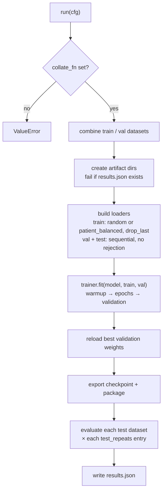

# RunCfg and the CLI

[`RunCfg`](../reference/api.md#run-cfg) is the boundary between assembling an experiment and executing it. Everything in it is an already-built object or a plain value — the runner knows nothing about loss functions or optimizers because those live inside the trainer. The CLI builds a `RunCfg` from a YAML file and calls [`run()`](../reference/api.md#run); writing Python directly means constructing the same object yourself (see [Train and export a sleep-staging model](train-sleep-staging.md)). This page lists every field, the exact execution order of `run()`, and all CLI commands.

## RunCfg fields

Required fields:

| Field | Type | Meaning |
| --- | --- | --- |
| `experiment_name` | `str` | Run name; artifacts go to `<log_path>/<experiment_name>/`. |
| `model_name` | `str` | Short model identifier written into test records and used as the package task fallback. |
| `model` | `nn.Module` | The constructed model to train. |
| `trainer` | object | Anything exposing `fit`, `test`, `save_checkpoint`, `classification_contract()`. |
| `train_datasets` | `list` | Training datasets; combined into one when several are given. |
| `val_datasets` | `list` | Validation datasets; combined if non-empty, else no validation. |
| `test_datasets` | `list[tuple[str, object]]` | Named test datasets as `(label, dataset)` pairs; each evaluated separately. |
| `batch_size` | `int` | Batch size for every loader. |
| `n_samples` | `int \| None` | Candidate budget per train/val epoch (candidates, not accepted samples — see [What rejection costs](train-multiclass.md#what-rejection-costs)). |
| `num_workers_dataloader` | `int` | DataLoader worker processes. |

Optional fields:

| Field | Default | Meaning |
| --- | --- | --- |
| `n_samples_test` | `None` | Candidate budget for test loaders. |
| `patients_per_epoch` | `None` | If set, training sampling becomes `patient_balanced` instead of `random` (see [Performance](performance.md#patientsampler-fewer-files-per-epoch)). |
| `patient_group_size` | `None` | Locality group size passed through to the patient sampler. |
| `test_repeats` | `[1]` | Each repeat `r` evaluates with `n_views=r` repeated overlapping views per window via a `RepeatedViewModel`. |
| `use_mlflow` | `False` | Additionally log to MLflow at `sqlite:///<log_path>/mlflow.sqlite`. |
| `log_path` | `"sleepwalker"` | Root directory for local artifacts. |
| `tags` | `{}` | Run tags. |
| `collate_fn` | `None` | **Must be set** — `run()` raises `ValueError` if it is `None`. The CLI defaults it to `batch_collate`. |
| `meta_data` | `{}` | Logged as hyperparameters and stored in the exported package's `config`. |
| `expert_task` | `None` | Task name for the exported package; falls back to `model_name`. |
| `export_package` | `True` | Whether to export the inference package after fitting. |
| `package_path` | `None` | Extra destination for the exported package. |

`run()` returns a [`RunResult`](../reference/api.md#run-result) carrying `experiment_name`, the trained model, the trainer, the raw `fit` dictionary, and one evaluation record per test dataset.

## What run() does



In order:

1. **Validate** that `collate_fn` is set.
2. **Combine** the train datasets (and validation datasets, if any) into single datasets.
3. **Guard the run directory.** `results.json` under `<log_path>/<experiment_name>/` must not exist yet; the run refuses to overwrite a finished experiment.
4. **Log** the resolved hyperparameters, model parameter counts, and `model.input_spec()`.
5. **Build loaders**: the training loader uses `patient_balanced` sampling when `patients_per_epoch` is set and `random` otherwise, with `drop_last=True`; validation and each test dataset get sequential loaders with `rejection_strategy="none"`.
6. **Fit** via `trainer.fit(...)`, which first warms up the trainer and the model preprocessors.
7. **Reload** the best validation weights when the trainer returned `best_model_state`.
8. **Export** the resumable checkpoint and, unless `export_package=False`, the inference package (see [Import and export model packages](package-import-export.md)).
9. **Evaluate** every test dataset, once per entry of `test_repeats`.
10. **Write** `results.json` with losses, confusion matrices, class order, and artifact paths.

!!! note "Seeding is the caller's job"
    `run()` does not seed anything. The CLI calls `seed_everything(seed)` from the YAML `seed` key before building anything; in Python you must call `sleepwalker.trainer.Run.seed_everything(seed)` yourself before constructing models, datasets, or samplers.

## The CLI

The `sleepwalker` command dispatches to subcommands:

| Command | Arguments | What it does |
| --- | --- | --- |
| `train` | `CONFIG [--fold FOLD]` | Full run from a YAML config. |
| `dry` | `CONFIG [--fold FOLD]` | One-epoch smoke test: caps patients (≤30/10/10), batch ≤16, tiny sample budgets, no MLflow, no package export, temp log dir. |
| `resume` | `CHECKPOINT` | Continue a run from `checkpoint.pt`. |
| `split` | `INPUT_DIR OUTPUT_FILE [--fractions T V T \| --folds N] [--seed S] [--filter-config YML] [--workers N]` | Build a deterministic, subject-level split manifest (holdout or ≥3-fold CV). |
| `evaluate` | `[--overwrite] CONFIG` | Evaluate a packaged classifier on EDF manifests → JSONL metrics. |
| `evaluate-system` | `[--overwrite] CONFIG` | Evaluate a dependency-aware system of packaged classifiers. |
| `foundation-model` | `download MODEL ROOT` / `convert MODEL MODEL_ROOT DEST` | Fetch and convert pinned external encoders (`sleepfm`, `sleepgpt`, `osf`) into `PackagedEmbeddingModel` packages. |
| `mirror-edf` | `SOURCE DEST CONFIG [...]` | Copy an EDF repo keeping only the channels/rate a config needs. |

There is **no `sleepwalker predict` command**; prediction from the CLI goes through `evaluate`, and single-recording prediction is a Python call (`package.predict_patient`, see [Predict sleep stages](predict-patient.md)). <!-- TODO: add a `sleepwalker predict` command. See the [roadmap](../roadmap.md#stabilize-command-line-prediction-and-evaluation). -->

## The YAML configuration

A training YAML has up to five top-level keys:

```yaml
seed: 17                 # passed to seed_everything (default 17)
fold: fold_0             # optional default fold, overridable with --fold
data:                    # one dataset mapping, or a list for multi-dataset training
  name: sleepwalker.datasets.SleepEDFx.SleepEDFx
  ...
model:
  name: sleepwalker.models.AttnSleep.AttnSleep
trainer:
  name: sleepwalker.trainer.MulticlassTrainer.MulticlassTrainer
  ...
run:
  experiment_name: my-run
  ...
```

**Component specs.** Every component is a mapping with a fully qualified dotted `name` plus its constructor arguments beside it. There is no short-name registry for models or trainers — you write the import path. A bare string starting with `sleepwalker.` or `torch.` is imported as a callable.

**Context injection.** Before building the model, the CLI derives `classes`, `sequence_len`, `input_channels`, `n_channels`, `ts_len`, and `sampling_frequency` from the first dataset entry and injects any of these that the model's constructor accepts but the YAML did not set. This is why the model in the example above needs no arguments: it cannot disagree with the data it trains on.

**Factories.** `trainer.optimizer` is turned into `lambda model: <symbol>(model.parameters(), **args)` and `trainer.lr_scheduler` into a `partial` the trainer completes with `epochs`/`steps_per_epoch` when the scheduler demands them. In YAML you therefore write plain constructor arguments:

```yaml
trainer:
  name: sleepwalker.trainer.MulticlassTrainer.MulticlassTrainer
  epochs: 50
  optimizer:
    name: torch.optim.Adam
    lr: 0.001
  loss_function: torch.nn.functional.cross_entropy
```

**Dataset entries.** Keys consumed by the CLI itself are `files`, `num_workers`, `strict`, `label`, `output_classes`, and `patient_filter`; everything else goes to the dataset constructor. `files` is either a path to a split manifest (from `sleepwalker split`) or a mapping of role → selector function with optional `validation_fraction` / `test_fraction` that carve held-out subsets from the training pool using the config `seed`. A `patient_filter` may only *remove* paths from a partition, never add or move them.

## Typical command sequences

```bash
# 1. Write a subject-level split once
sleepwalker split data/sleep-edfx/SC splits/edfx.yml --folds 3 --seed 42

# 2. Smoke-test the configuration
sleepwalker dry configs/examples/sleep_edfx_multiclass.yml

# 3. Train one fold for real
sleepwalker train configs/examples/sleep_edfx_multiclass.yml --fold fold_0

# 4. Resume if the run died before finishing
sleepwalker resume results/tutorial/my-run/final/checkpoint.pt
```

`resume` locates the original configuration at `<experiment>/hparams.yml` next to the checkpoint's parent directory, re-seeds, rebuilds the datasets from it, and continues at the first epoch that did not complete. It re-enters `run()`, so a run that already wrote its `results.json` cannot be extended, and the rebuilt loader must have the same steps per epoch as the checkpoint. These limitations are tracked on the [roadmap](../roadmap.md#resume-runs-reliably).

!!! warning "Trainers default to cuda:0"
    `MulticlassTrainer` and friends default to `device="cuda:0"`, and the CLI does not override this. On a CPU-only machine, set `device: cpu` in the trainer section or the run fails inside CUDA initialization. See the [roadmap](../roadmap.md#detect-the-training-device).
