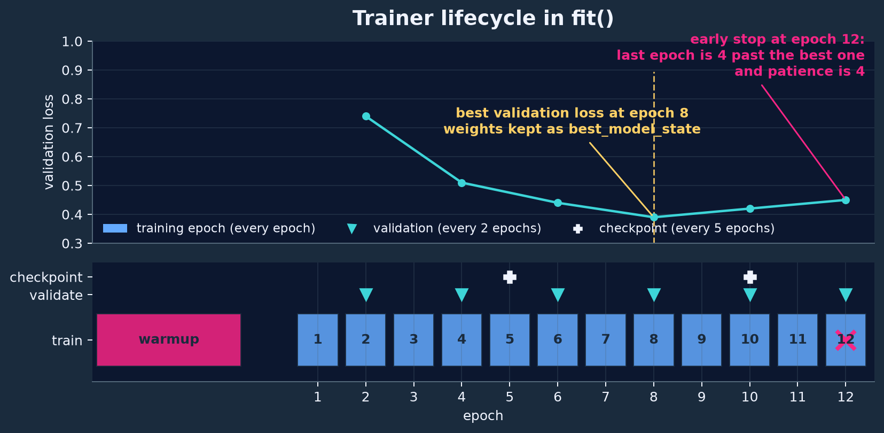

# Train a multiclass model

This guide trains a single-head multiclass model, for example five-class sleep staging, from EDF recordings. It assumes you already know how to [Load some data](data.md). Here we cover what a [trainer](#trainer) is and how it executes a run, where filtering belongs in that pipeline, what rejection costs during training, how the trainer interprets targets, and how a run is assembled and executed.

# Trainer

The model maps input windows to logits. The trainer owns everything around that mapping: the loss function, the optimizer and learning-rate schedule, the epoch and validation cadence, early stopping, checkpointing, and the metrics that a run reports. This split lets you reuse one model on a different task by pairing it with a different trainer: [`MulticlassTrainer`](../reference/api.md#multiclass-trainer) handles single-head softmax tasks such as sleep staging, while `MultiLabelTrainer` handles several overlapping label sets per window (see [Multilabel targets](multilabel.md)).

## Configuring a trainer

The arguments of [`MulticlassTrainer`](../reference/api.md#multiclass-trainer) fall into four groups: the task definition (`classes`, `target_resolution`, `sequence_len`), the optimization parts (`loss_function`, `optimizer`, `lr_scheduler`), the schedule (`epochs`, `eval_every`, `save_every`, `early_stopping`, `return_best`), and the compute devices (`device` for training and inference, `warmup_device` for preprocessor warmup). Written in Python:

```python
import torch

from sleepwalker.trainer.MulticlassTrainer import MulticlassTrainer

trainer = MulticlassTrainer(
    epochs=50,
    optimizer=lambda model: torch.optim.Adam(model.parameters(), lr=1e-3),
    classes=classes,
    loss_function=torch.nn.functional.cross_entropy,
    target_resolution="30s",
    eval_every=2,
    early_stopping=4,
    device="cuda:0",
)
```

`optimizer` and `lr_scheduler` are *factories*, not instances: the optimizer factory receives the model, the scheduler factory receives the optimizer, and the trainer calls them at the start of the first `fit()` and keeps the resulting objects. A YAML configuration performs the factory wrapping for you:

```yaml
trainer:
  name: sleepwalker.trainer.MulticlassTrainer.MulticlassTrainer
  epochs: 50
  optimizer:
    name: torch.optim.Adam
    lr: 0.001
```

This is equivalent to the lambda above: the config builder injects `model.parameters()` as the first argument. Hand-written Python has to do that itself.

!!! warning "`optimizer` is not an optimizer"
    Writing `optimizer=partial(torch.optim.Adam, lr=1e-3)` is tempting and wrong: the factory receives the model module, and `torch.optim.Adam(model, lr=...)` fails with a `TypeError` because a module is not an iterable of parameters. Use `lambda model: torch.optim.Adam(model.parameters(), lr=1e-3)`. The YAML path injects `model.parameters()` automatically. See the [roadmap](../roadmap.md#accept-optimizer-factories-that-receive-the-model) for making both forms work.

## What happens inside fit()

The trainer executes the training lifecycle through `fit(model, train_loader, val_loader)`. The figure below shows a run with `eval_every=2`, `save_every=5`, and `early_stopping=4`:


*A constructed `fit()` example with `eval_every=2`, `save_every=5`, and `early_stopping=4`; the validation values are schematic, not measured.*

1. **Warm up the trainer.** The subclass hook `warmup_trainer()` runs before the first update step. For `MulticlassTrainer` this estimates class counts with a full pass over the training loader — but only when they are needed, that is when `loss_mode` selects loss reweighting or `balance_batches` is enabled and no `class_counts` were supplied. See [Class imbalance](#class-imbalance).
2. **Warm up the model preprocessors.** The trainer streams the complete training loader through every model preprocessing step whose `requires_warmup()` returns true so each step can update its statistics, on `warmup_device` (default `"cpu"`), before the model moves to `device`. Models that need a different warmup procedure can implement their own.
3. **Build the optimizer and the schedule.** The optimizer factory is called with the model, `steps_per_epoch` is fixed to `len(train_loader)`, and the learning-rate scheduler is built once. A scheduler that requires `total_steps` but was configured without one receives `epochs * steps_per_epoch`. Schedulers step once per epoch, with the exception of `OneCycleLR` and `CyclicLR`, which the trainer steps after every batch because they are built for a per-batch schedule.
4. **Train.** Each epoch sets the sampler epoch (so random samplers draw a fresh permutation), puts the model into train mode, and runs `run_epoch`: forward pass, loss, backward pass, optimizer step. If `train_transform` is configured, the input is pushed through those callables first, and only on training epochs; validation and test see the raw batch.
5. **Validate, track the best epoch, stop.** Validation runs every `eval_every` epochs. After each validation, a new minimum of the recorded validation losses marks that epoch as best, and with `return_best=True` the trainer deep-copies the weights to CPU as `best_model_state` (ties go to the first epoch that achieved the minimum loss). Early stopping then breaks the loop on the first validation epoch whose distance to the best epoch reaches the patience:

   $$
   \text{epoch} - \text{epoch}_\text{best} \ge \texttt{early\_stopping}.
   $$

   If no validation loader is given, early stopping is disabled with a warning.
6. **Checkpoint.** Every `save_every` epochs the trainer serializes itself, the model, and the RNG state into a checkpoint (`save_checkpoint()` / `load_checkpoint()`). `sleepwalker resume` continues from such a checkpoint: the optimizer, scheduler, and RNG states are restored and training continues at the first epoch that did not complete. A resumed run requires the new training loader to have the same number of steps per epoch; to train longer, raise `epochs`. See [RunCfg and the runner](#runcfg-and-the-runner) for the command and its current caveats.
7. **Return.** `fit()` returns `{"losses": [...], "outputs": [...]}` with one `{"train": ..., "val": ...}` entry per epoch — scalar epoch losses and epoch confusion matrices — plus `best_model` and `best_model_state` when a best epoch was recorded and `return_best` is set.

!!! warning "Validation runs on multiples of `eval_every` only"
    Validation, best-epoch tracking, and the early-stopping check all happen only when the 1-based epoch number is a multiple of `eval_every`, which defaults to 10. A run with `epochs=5` and the default `eval_every` therefore never validates: no `VAL` progress line appears, no best weights are recorded, and `early_stopping` has no effect — as in the short example at the end of this page, which shows only `TRAIN` and `TEST` lines. Set `eval_every=1` if a short run should validate and early-stop every epoch.

Within an epoch, the trainer validates the shapes it receives: logits and targets must both be `[B, sequence_len, K]`, and a model that declares `epoch_len_s` is checked against `target_resolution / sequence_len` (see [From windows to class labels](#from-windows-to-class-labels)).

### The epoch loss is a per-step mean

The reported epoch loss is not the plain mean of the batch losses, because batches can differ in size and in how many of their steps carry a valid target. With batch loss \(\mathcal{L}_b\) and \(n_b\) valid steps in batch \(b\), the trainer reports

$$
\mathcal{L}_\text{epoch} = \frac{\sum_{b} n_b\,\mathcal{L}_b}{\sum_{b} n_b},
$$

so every valid step contributes equally to the epoch loss. A batch in which every step is masked contributes nothing, and for unmasked batches \(n_b = B \cdot S\).

### Metrics come from the confusion matrix

Predictions are \(\arg\max_k p_{s,k}\) restricted to valid steps, and every metric is computed from the confusion matrix of those steps. Each batch updates a running epoch confusion matrix and a progress line of the form

```text
TRAIN [5/5]  0.0475 acc 98.511 f1 (mi/ma) 0.9851/0.9837 κ 0.980
```

with the running epoch loss, accuracy, micro- and macro-averaged F1, and Cohen's \(\kappa\); for single-label targets the micro-F1 equals the accuracy. At the end of the epoch the trainer logs the complete confusion matrix as a figure, and the runner stores it in `results.json`.

!!! note "No per-sample predictions from `fit()` or `test()`"
    The trainer reports losses and confusion matrices only. To inspect the predicted label of every window, run the trained model through a loader yourself or use the exported package through [`predict_patient()`](../reference/api.md#predict-patient) (see [Predict sleep stages](predict-patient.md)). <!-- TODO: the API reference lists a `predict` member of `MulticlassTrainer` that the code does not implement. See the [roadmap](../roadmap.md#expose-trainer-predictions). -->

## From windows to class labels

Sleep staging is the canonical multiclass problem in this library. Sleep staging assigns 30s windows of a patient to one of the five sleep stages `wake`, `n1`, `n2`, `n3`, and `rem` that represent different states of a human sleep cycle. The model maps one input window to a sequence of \(S\) predictions and emits one logit vector per step. As an example, consider the classic combination of softmax + cross-entropy which leads to this loss:

$$
p_{s,k} = \frac{\exp(z_{s,k})}{\sum_{k'} \exp(z_{s,k'})}, \qquad
\mathcal{L} = - \frac{1}{B \cdot S} \sum_{b=1}^{B} \sum_{s=1}^{S} \sum_{k=1}^{K} y_{b,s,k} \log p_{b,s,k}.
$$

where \(B\) is the batch size, \(S\) is the number of steps and \(K\) is the number of classes. A regular multi-class classification problem usually uses \(S=1\). Since sleep staging has some interdependencies between stages, many state-of-the-art models predict multiple steps at-once. Hence, the expected output of a model has the shape `[B, S, K]`. The default reduction of `torch.nn.functional.cross_entropy` is `mean`, so the normalization is by the number of steps \(B \cdot S\), not by \(B\).

!!! important "Masking certain steps"
    [`MulticlassTrainer`](../reference/api.md#multiclass-trainer) supports masking of certain steps, when they do not offer a valid prediction target, via a `target_mask` entry returned by `prepare_target`. The loss is then the mean over unmasked steps only:

    $$
    \mathcal{L} = - \frac{1}{\sum_{b=1}^{B} \sum_{s=1}^{S} m_{b,s}} \sum_{b=1}^{B} \sum_{s=1}^{S} m_{b,s} \sum_{k=1}^{K} y_{b,s,k} \log p_{b,s,k},
    $$

    where \(m_{b,s} \in \{0, 1\}\) is the mask value for step \(s\) of sample \(b\). Masked steps contribute neither to the loss nor to the metrics.


The trainer also needs to know how much real time one prediction covers. `target_resolution` is the duration covered by all predictions of one input window, and `sequence_len` is the number of steps, so one step covers `target_resolution / sequence_len` seconds. Models that declare a native step length are checked against it:

$$
\frac{\texttt{target\_resolution}}{S} = \texttt{epoch\_len\_s}.
$$

Note that the trainer does not *select* the supervised interval inside the input window; that stays in `prepare_target` (see the note on target placement in [Load some data](data.md)).


!!! important "The `classes` list is the label order everywhere"
    `target_classes` in [`prepare_multiclass_target()`](../reference/api.md#prepare-multiclass-target), `classes` in the model, and `classes` in the trainer describe the same order. Index \(k\) in a one-hot target is the \(k\)-th entry of that list, and the confusion matrix rows and columns use it as well. A reordered list silently changes the meaning of every prediction.

## Three filters, three costs

A [`BaseDataset`](../reference/api.md#base-dataset) exposes three optional hooks. They differ in *when* they run and *what* they may reject, and that difference is a performance decision, not a stylistic one.

| Hook | Runs | Sees | Can drop | Typical use |
| --- | --- | --- | --- | --- |
| `prepare_patient` | once per patient during `initialize()` | mapped annotation table, no signal | a whole patient, or label ranges | trim leading/trailing wake, drop patients with too little sleep |
| `prepare_target` | once per candidate window, *before* the signal is read | label activity in the input window | one window | coverage thresholds, one-hot target construction |
| `prepare_sample` | once per window, *after* the signal is read, resampled and normalized | signal tensor plus target | one window | NaN, flatline, or quality-channel checks |

The default `prepare_sample` is [`prepare_tensor_sample()`](../reference/api.md#prepare-tensor-sample), which converts the window to a `torch.Tensor` and already implements the common signal-quality rejections through `max_nan_fraction`, `min_std`, `valid_ranges`, and `quality_max_mean`. The default `prepare_patient` and `prepare_target` are `None`, that is: no patient-level trimming and raw label activity as the target.

`prepare_patient` receives the mapped annotation table and returns a `(label_df, label_extra_df)` pair. Sleep staging normally wants the night, not the hour of quiet wakefulness before the first sleep epoch:

```python
from functools import partial

from sleepwalker.training.callbacks import trim_patient_to_events

dataset = SleepEDFx(
    ...,
    prepare_patient=partial(trim_patient_to_events, keep_events=["n1", "n2", "n3", "rem"]),
)
```

After `prepare_patient` returns, `initialize()` no longer treats the recording as one continuous usable region. It scans the retained intervals for gaps and builds a per-patient list of window offsets that lie inside the connected blocks of retained labels. A night whose annotations stop after the last sleep epoch therefore yields windows only around the actual sleep period, and the gaps between annotation blocks are never sampled. Use [`trim_patient_to_events`](../reference/api.md#patient-callbacks) or [`prepare_patient_events`](../reference/api.md#patient-callbacks) for this; the latter additionally drops events shorter than `min_seconds`.

!!! note "`prepare_patient` rejects annotations, not patients"
    Returning `None` from `prepare_patient` drops that patient during initialization. Dropping the last annotation of a patient that is configured with an `event_mapping` raises an error instead, because such a patient can never produce a labelled window. Cohort-level decisions that compare patients to each other ("drop the shortest sleepers") do not belong in this hook either: they need statistics over all patients, which is what `get_patient_stats(...)` and the configured `patient_filter` in a training config are for. Split-level filters may only *remove* paths from an existing partition, never add new ones.

`prepare_target` runs per candidate window and is the cheapest place to reject data because no signal has been touched yet. `prepare_multiclass_target()` is the standard implementation; it also performs the coverage rejection described in [Load some data](data.md). A custom version can add task logic around it. The dataset calls the callback with `target`, `target_extra`, `patient`, and `time`, and expects a dictionary (or `None` to reject), so a wrapper fixes the target arguments with `partial` and adds its own test:

```python
from sleepwalker.trainer.utils.targets import prepare_multiclass_target

CLASSES = ["wake", "n1", "n2", "n3", "rem"]
SLEEP = ["n1", "n2", "n3", "rem"]


def prepare_sleeping_window(target, target_extra=None, patient=None, time=None, **kwargs):
    if target is None or target[SLEEP].to_numpy().sum() == 0:
        return None
    return prepare_multiclass_target(target, target_extra=target_extra, **kwargs)


dataset = SleepEDFx(
    ...,
    prepare_target=partial(
        prepare_sleeping_window,
        target_classes=CLASSES,
        target_resolution="30s",
    ),
)
```

This wrapper rejects every window that contains no sleep at all, which on recording SC4001E0 keeps 62 of 241 evenly spaced candidate windows: the annotated pre-sleep wake period drops out, and the accepted items carry `data`, `target`, `patient`, and `time` with a target of shape `[1, 5]`. Note that the wrapper returns whatever `prepare_multiclass_target()` produced, one dict entry `target` and, if `step_mask` was requested, `target_mask` — those entries replace the raw activity table under the same keys, and the trainer reads them.

`prepare_sample` is the last chance to drop a window and the only one that sees the signal:

```python
from functools import partial

from sleepwalker.datasets.Basedataset import prepare_tensor_sample


prepare_sample = partial(
    prepare_tensor_sample,
    max_nan_fraction=0.01,
    min_std={"eeg": 1.0},
    valid_ranges={"eeg": [-300.0, 300.0]},
    max_out_of_range_fraction=0.05,
)
```

This rejects windows with more than one percent missing samples, a standard deviation below `1.0`, or more than five percent of samples outside the given amplitude range. The checks run *after* resampling and after the channel normalizer of the [`ChannelConfig`](../reference/api.md#channel-config), because the normalizer is applied to the window right before `prepare_sample`. `EEGFilterNormalizer` only filters and rescales by its `mean`/`std` arguments, which default to `0.0` and `1.0`, so the thresholds above are in the channel unit, here microvolts. On recording SC4001E0 the filtered EEG spans standard deviations of about \(7.8\,\mu\mathrm{V}\) to \(42.6\,\mu\mathrm{V}\) across 30-second windows, so these thresholds reject nothing for that night while still catching a disconnected or saturated electrode.

## What rejection costs

Item retrieval is rejection sampling: a candidate window is drawn from the precomputed index, `prepare_target` and `prepare_sample` may reject it, and the dataset then either returns nothing or draws a replacement according to `rejection_strategy`.

$$
\begin{aligned}
\texttt{"none"} & \quad \text{the requested index only;} \\
\texttt{"patient"} & \quad \texttt{online\_max\_tries} - 1 \text{ further windows from the same patient;} \\
\texttt{"global"} & \quad \texttt{online\_max\_tries} \text{ further windows from the whole cohort;} \\
\texttt{"patient\_then\_global"} & \quad \text{both, patient first (default).}
\end{aligned}
$$

Fallbacks buy yield with work. If a fraction \(r\) of candidates is rejected, then producing one accepted window takes about \(1/(1-r)\) candidate evaluations. The numbers below are from three Sleep-EDFx recordings (8283 indexed 30 s windows) on a local SSD with a warm file cache, using a `prepare_target` that accepts only windows scored entirely `n2`, that is \(r \approx 0.87\) here:

| `rejection_strategy` | accepted items per 500 requested indices | ms per requested index |
| --- | --- | --- |
| `none` | 67 | 0.46 |
| `patient_then_global` | 497 | 3.40 |

Same work per accepted sample, seven times the yield, about seven times the time. Two consequences matter in practice:

1. **Filter where the information is.** A label-only rule in `prepare_target` costs about \(0.45\) ms per window in this setup; reading, resampling and normalizing that window costs about \(1.7\) ms. Moving a rule that needs no signal from `prepare_sample` to `prepare_target` therefore saves the I/O, and moving it to `prepare_patient` removes whole regions from the index so they are never even drawn.
2. **`n_samples` counts candidates, not samples.** A training loader requests `n_samples` candidate indices per epoch. With `rejection_strategy="none"`, rejected candidates simply do not appear, so an epoch sees roughly \((1-r)\cdot\) `n_samples` samples. With fallbacks the epoch is full but pays the retries.

!!! warning "Rejected samples also shrink batches"
    Batches are assembled by `collate_valid_samples`. If `drop_last` is set, a batch is skipped as soon as *one* of its samples was rejected, not only when the final batch is short. Training loaders use `drop_last=True`, and the trainer skips `None` batches silently. Validation and test loaders are built with `rejection_strategy="none"`, so a strict target callback shrinks evaluation sets instead of failing: check the sample counts in the logged confusion matrices before concluding that a model improved.

## Class imbalance

Sleep-stage distributions are strongly skewed: `n2` dominates a night and `n1` is rare. `MulticlassTrainer` offers three levers, all applied in its warmup step.

Weighted cross entropy multiplies the per-sample loss of class \(c\) by \(w_c\). With `loss_mode="inverse"`, the weights follow the observed counts \(n_c\) and are normalized to sum to one; with `loss_mode="inverse-log"` they follow the log-frequency variant of AttnSleep and MRASleepNet, with optional manual multipliers \(u_c\) from `class_weights` (the same multipliers also scale the inverse weights):

$$
w_c \propto \frac{1}{n_c} \quad\text{(inverse)}, \qquad
w_c = \mu_c \max\!\left(1, \log \frac{\mu_c N}{n_c}\right), \quad \mu_c = \frac{u_c}{K} \quad\text{(inverse-log)}.
$$

See [`class_weights_for_loss()`](../reference/api.md#class-weights-for-loss). The counts \(n_c\) come from `class_counts` if you provide them, otherwise the trainer traverses the training loader once during warmup to estimate them, which costs one extra pass over `n_samples` candidates. Passing `class_counts` explicitly is the cheaper option when the distribution is already known, for example from a previous run.

`balance_batches=True` goes the other way: instead of reweighting the loss, it rejects overrepresented samples during target preparation with acceptance probability

$$
p_\text{keep} = \min\!\left(1, \left(\frac{p_{c^*}}{p_{y}}\right)^{\gamma}\right),
$$

where \(p_c\) is the relative frequency of class \(c\), \(c^*\) the rarest class, \(y\) the candidate target, and \(\gamma=\) `balance_gamma`. \(\gamma=1\) matches the raw frequency ratio, larger \(\gamma\) balances harder.

!!! warning "`balance_batches` does not reach persistent DataLoader workers"
    Balancing is implemented by wrapping the dataset `prepare_target` callback *after* the class counts have been estimated, that is after the loader and its workers already exist. With `num_workers > 0` the workers hold their own dataset copies and keep using the unwrapped callback, so the balancing silently has no effect. The code marks this as an open issue; see the [roadmap](../roadmap.md#make-batch-balancing-work-in-dataloader-workers).

## RunCfg and the runner

Training scripts assemble the experiment; the runner executes it. [`RunCfg`](../reference/api.md#run-cfg) is the boundary: it holds objects, not instructions, and knows nothing about epochs or optimizers because those live in the trainer.

| Group | Fields | Meaning |
| --- | --- | ---
| Identity | `experiment_name`, `model_name`, `tags`, `meta_data` | run names, log tags, and the logged hyperparameters |
| Assembly | `model`, `trainer`, `train_datasets`, `val_datasets`, `test_datasets`, `collate_fn` | already-built objects; test datasets are `(name, dataset)` pairs |
| Loaders | `batch_size`, `n_samples`, `n_samples_test`, `num_workers_dataloader`, `patients_per_epoch`, `patient_group_size`, `test_repeats` | how the datasets are turned into `DataLoader`s |
| Outputs | `log_path`, `use_mlflow`, `export_package`, `package_path`, `expert_task` | artifact directory, MLflow logging, and the exported model package |

[`run()`](../reference/api.md#run) then does, in order:

1. combine the train (and validation) datasets into one dataset when several were given,
2. build a training loader with random or, if `patients_per_epoch` is set, patient-balanced sampling, and sequential loaders for validation and each test dataset,
3. call `trainer.fit(...)`, which first warms up the trainer (class counts, loss weighting) and the model preprocessors,
4. reload the weights of the best validation epoch when the trainer returned `best_model_state`,
5. write a resumable checkpoint and, unless `export_package=False`, the inference package that `predict_patient()` consumes later,
6. evaluate every test dataset, optionally with several repeated views per window (`test_repeats`), and
7. write `results.json` under `<log_path>/<experiment_name>/`.

`n_samples` and `n_samples_test` are candidate counts as described above. `test_repeats` above 1 additionally evaluates with repeated overlapping views per window through a `RepeatedViewModel`. [`RunResult`](../reference/api.md#run-result) carries the experiment name, the trained model, the trainer, the raw `fit` dictionary (`losses` and `outputs` per epoch, plus `best_model` and `best_model_state` when the trainer returns the best weights), and one evaluation record per test dataset. The confusion matrices, losses, class order, and artifact paths are written to `results.json`.

!!! note "One run, one result file"
    `run()` raises `FileExistsError` if `<log_path>/<experiment_name>/results.json` already exists instead of overwriting a previous experiment. Change the `experiment_name` for a variant. Use `seed_everything(seed)` before building models, datasets, or samplers to make a run reproducible.

## A complete example

`configs/examples/sleep_edfx_multiclass.yml` puts the pieces together: a dataset with its channels, label mapping, and callbacks; a model; a trainer; and the run options. It is the configuration of this guide, run exactly as written below.

```yaml
seed: 17

data:
  name: sleepwalker.datasets.SleepEDFx.SleepEDFx
  channels:
    - logical_name: eeg
      physical_names: [EEG Fpz-Cz]
      unit: uV
      normalizer:
        name: sleepwalker.datasets.normalizer.EEGFilterNormalizer.EEGFilterNormalizer
        fs: 100
  sample_frequency: 100
  event_mapping:
    sleep stage w: wake
    sleep stage 1: n1
    sleep stage 2: n2
    sleep stage 3: n3
    sleep stage 4: n3
    sleep stage r: rem
  total_input: 30s
  stride: 30s
  assume_units_if_missing: false
  output_classes: &classes [wake, n1, n2, n3, rem]
  prepare_patient:
    name: sleepwalker.training.callbacks.trim_patient_to_events
    keep_events: [n1, n2, n3, rem]
  prepare_target:
    name: sleepwalker.trainer.utils.targets.prepare_multiclass_target
    target_resolution: 30s
    target_classes: *classes
  patient_filter:
    name: sleepwalker.training.files.filter_edf_files
  files:
    train:
      name: sleepwalker.datasets.utils.get_edf_files_in_repo
      root: data/sleep-edfx/SC
    validation_fraction: 0.1
    test_fraction: 0.2
  label: sleep-edfx
  num_workers: 2

model:
  name: sleepwalker.models.AttnSleep.AttnSleep

trainer:
  name: sleepwalker.trainer.MulticlassTrainer.MulticlassTrainer
  target_resolution: 30s
  epochs: 5
  optimizer:
    name: torch.optim.Adam
    lr: 0.001
  loss_function: torch.nn.functional.cross_entropy
  early_stopping: 3
  device: cpu

run:
  experiment_name: sleep-edfx-attnsleep-multiclass
  model_name: attnsleep
  batch_size: 32
  n_samples: 4096
  n_samples_test: 1024
  num_workers_dataloader: 2
  test_repeats: [1]
  use_mlflow: false
  log_path: results/tutorial
  expert_task: sleep
```

Every component is named by its fully qualified import path and its constructor arguments sit beside the name. `output_classes` fixes the shared class order once and `&classes` reuses it for the target builder. `n_channels`, `ts_len`, `sampling_frequency`, and `sequence_len` are injected into the model from the dataset, so the model cannot disagree with the data it is trained on. `device` is the trainer's compute target, and trainers default to `cuda:0`, so an example that must also run without a GPU sets it explicitly. Start with the dry run, then train:

```bash
sleepwalker dry configs/examples/sleep_edfx_multiclass.yml    # one epoch, capped patients and samples
sleepwalker train configs/examples/sleep_edfx_multiclass.yml   # the real run
```

`dry` is the validation path: it caps patients and sample budgets, forces one epoch, disables MLflow and package export, and logs to a temporary directory. Before the first update step the log says which recordings survived and how large the candidate index became:

```text
Patient filter kept 2/5 EDF files; excluded by reason: {'missing_required_channel': 3}
Dataset initialized with 1/2 patients. Total windows: 723. Classes: 5
Model parameters: 466,645 trainable / 466,645 total
Input data is 3000 x 1
```

These lines carry information. `get_edf_files_in_repo` returns every EDF in the directory, including the hypnograms, and `filter_edf_files` keeps the ones that carry the required signal channels. The initialization line reports the size of the candidate index after the annotation-based windowing described above; the `1/2` is a patient that `prepare_patient` or the loader could not use, here a recording whose hypnogram is missing from the checkout. Then five epochs run on 4096 candidate windows and the final numbers appear:

```text
TRAIN [5/5]  0.0475 acc 98.511 f1 (mi/ma) 0.9851/0.9837 κ 0.980: 100%|██████████| 4096/4096
TEST         1.1760 acc 77.954 f1 (mi/ma) 0.7795/0.6515 κ 0.687: 100%|██████████| 1024/1024
```

Train accuracy near 99% against test accuracy near 78% on a single held-out night is what a three-recording smoke test looks like, not a benchmark. It does show the intended reading of the pipeline: the same `n_samples=4096` budget produced 4096 accepted training windows, and the reported test metrics are computed over the 1024 candidates requested from the test patient. Afterwards the run directory holds the artifacts:

```text
results/tutorial/sleep-edfx-attnsleep-multiclass/
├── hparams.yml            # the resolved configuration of this run
├── results.json           # train/test losses, confusion matrices, classes, paths
├── figures/               # train, validation, and test confusion matrices
└── final/
    ├── checkpoint.pt      # resumable trainer state plus the selected weights
    └── package/           # inference package for predict_patient()
```

`resume` restores trainer state from a checkpoint and rebuilds the datasets and run options from the `hparams.yml` of that run:

```bash
sleepwalker resume results/tutorial/sleep-edfx-attnsleep-multiclass/final/checkpoint.pt
```

It continues at the first epoch that did not complete, and it re-enters `run()`, so it refuses to start once the run has written its `results.json`. A finished run cannot be extended this way, and a run shorter than `save_every` epochs (ten by default) has no intermediate checkpoint; see the [roadmap](../roadmap.md#resume-runs-reliably).

Patient lists are resolved once per configuration: `files` is evaluated against the dataset, `validation_fraction` and `test_fraction` are drawn from the remaining training pool with the config `seed`, and `patient_filter` narrows each partition without ever moving patients between them. For cross-validation, write that partition once as a manifest, point `data.files` at the manifest, and train one fold at a time:

```bash
sleepwalker split data/sleep-edfx/SC splits/sleep-edfx.yml --folds 3 --seed 42
sleepwalker train configs/examples/sleep_edfx_multiclass.yml --fold fold_0
```

`--fold` selects one `folds:` entry of the manifest, appends the fold name to `experiment_name`, and records it as a run tag, so the folds of one configuration land in separate run directories.

## Where to go next

- A shorter end-to-end tutorial that also exports a model package for prediction: [Train and export a sleep-staging model](train-sleep-staging.md).
- Write the same run as plain Python and add your own callbacks or model: [Train and export a sleep-staging model](train-sleep-staging.md).
- Overlapping events and several labels per window instead of one class: [Multilabel targets](multilabel.md).
- Evaluate an existing package on a new recording: [Predict sleep stages](predict-patient.md).

<!-- TODO: The runner still performs test evaluation inside `run()` and marks this as an open design question, so a training run cannot be executed without a test dataset. See the [roadmap](../roadmap.md#separate-test-evaluation-from-the-training-runner). -->
